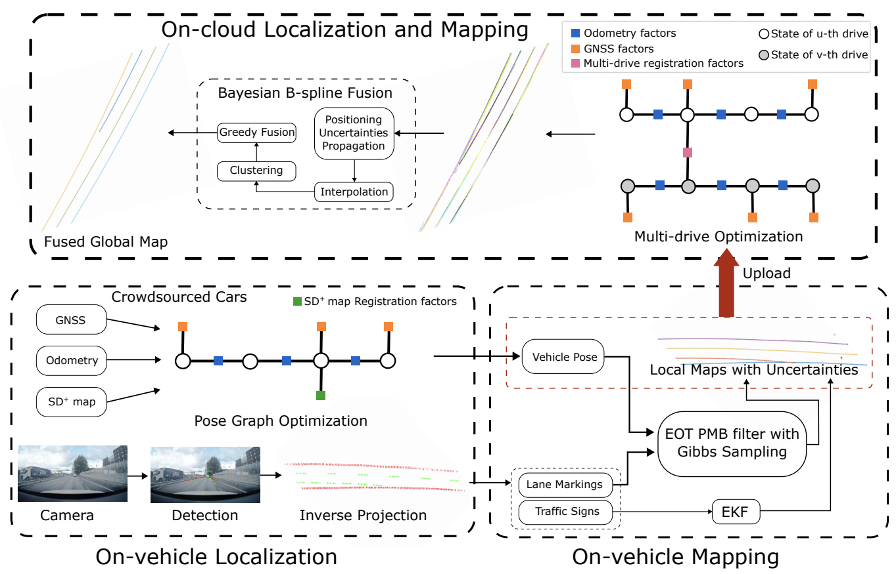

<div style="display: flex; justify-content: space-around; margin-bottom: 1em; margin-top: 0.5em; width=100%">
<figure class="figure__background">
  
  <figcaption><b>Fig 1.:</b> System overview of the proposed pipeline, including three modules: on-vehicle localization, on-vehicle mapping, and on-cloud localization and mapping. Note that traffic signs in the local maps are represented as semantic points and lane lines are represented by B-splines. With B-splines continuous over time, it is bandwidth efficient when uploading the control points to the cloud. On the cloud, after optimization to eliminate positioning errors in the estimated lane lines, the Bayesian B-spline fusion algorithm performs map fusion while maintaining the same B-spline representations.</figcaption>
</figure>
</div>

---

# Abstract
Crowd-sourced mapping offers a scalable alternative to creating maps using traditional survey vehicles. Yet, existing methods either rely on prior high-definition (HD) maps or neglect uncertainties in the map fusion. In this work, we present a complete pipeline for HD map generation using production vehicles equipped only with a monocular camera, consumer-grade GNSS, and IMU. Our approach includes on-cloud localization using lightweight standard-definition maps, on-vehicle mapping via an extended object trajectory (EOT) Poisson multi-Bernoulli (PMB) filter with Gibbs sampling, and on-cloud multi-drive optimization and Bayesian map fusion. We represent the lane lines using B-splines, where each B-spline is parameterized by a sequence of Gaussian distributed control points, and propose a novel Bayesian fusion framework for B-spline trajectories with differing density representation, enabling principled handling of uncertainties. We evaluate our proposed approach, B2F-Map, on large-scale real-world datasets collected across diverse driving conditions and demonstrate that our method is able to produce geometrically consistent lane-level maps.

# Results
Let's look at some qualitative results, lane-level HD maps from production vehicles, overlayed on google satellite images.
<div>
<video controls autoplay loop muted style="width: 100%;">
  <source src="final.mp4" type="video/mp4">
  Your browser does not support the video tag.
</video>
<figcaption> <b>Lane-level HD maps overlayed with satellite images</b> </figcaption>
</div>


# Bibtex
```bibtex
@article{xie2026b2fmap,
  title        = {$B^2F$-Map: Crowd-sourced Mapping with Bayesian B-spline Fusion},
  author       = {Xie, Yiping and Xia, Yuxuan and Stenborg, Erik and Fu, Junsheng and Beauvisage, Axel and Garcia, Gabriel E and Wu, Tianyu and Hendeby, Gustaf},
  journal      = {2026 IEEE International Conference on Robotics and Automation (ICRA)},
  year         = {2026}
}
``` 