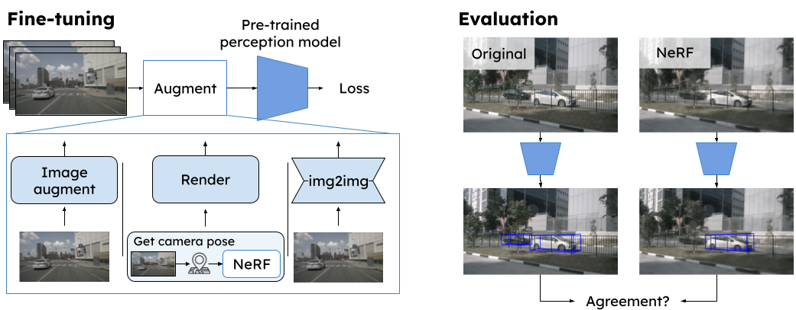
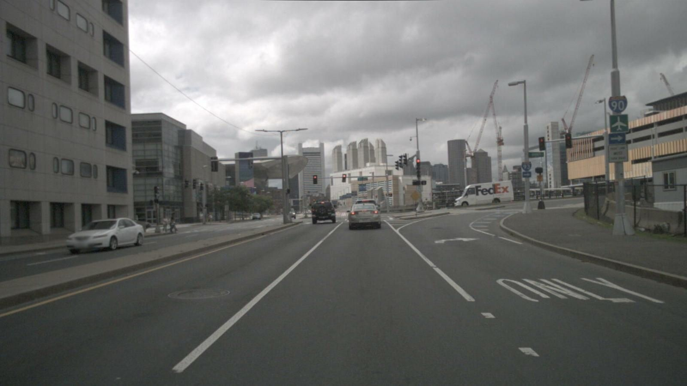
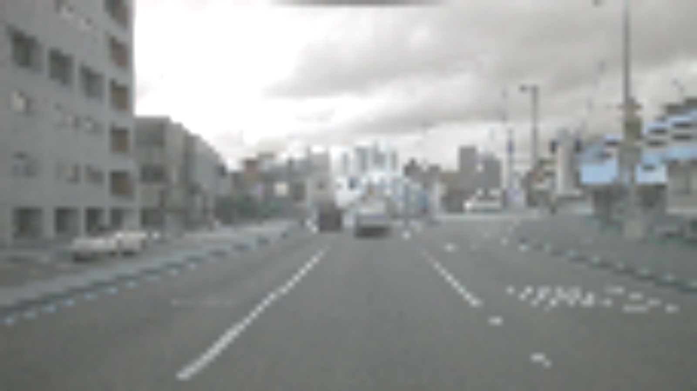
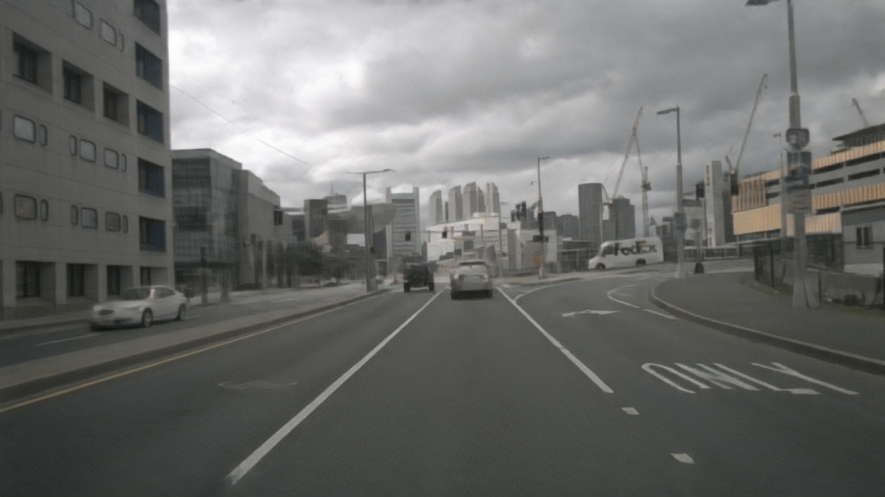
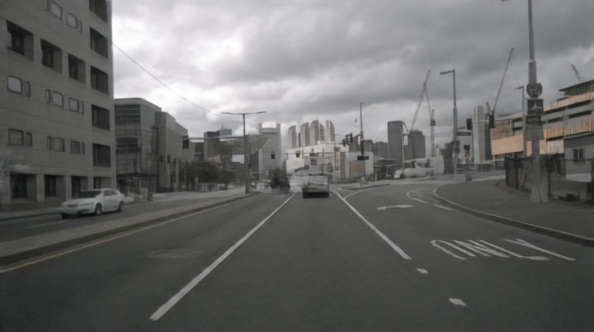
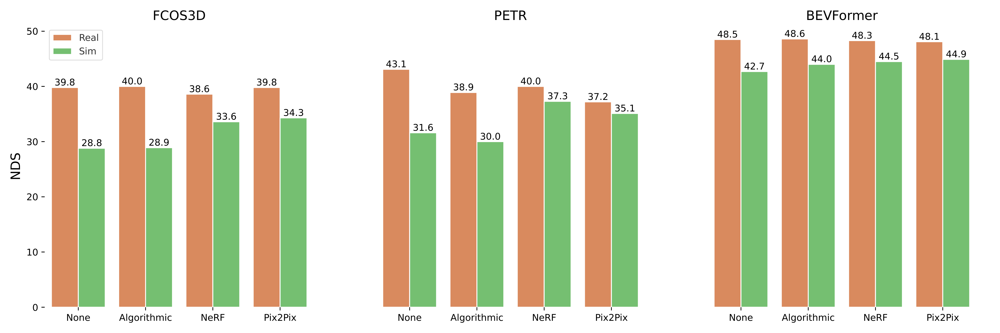
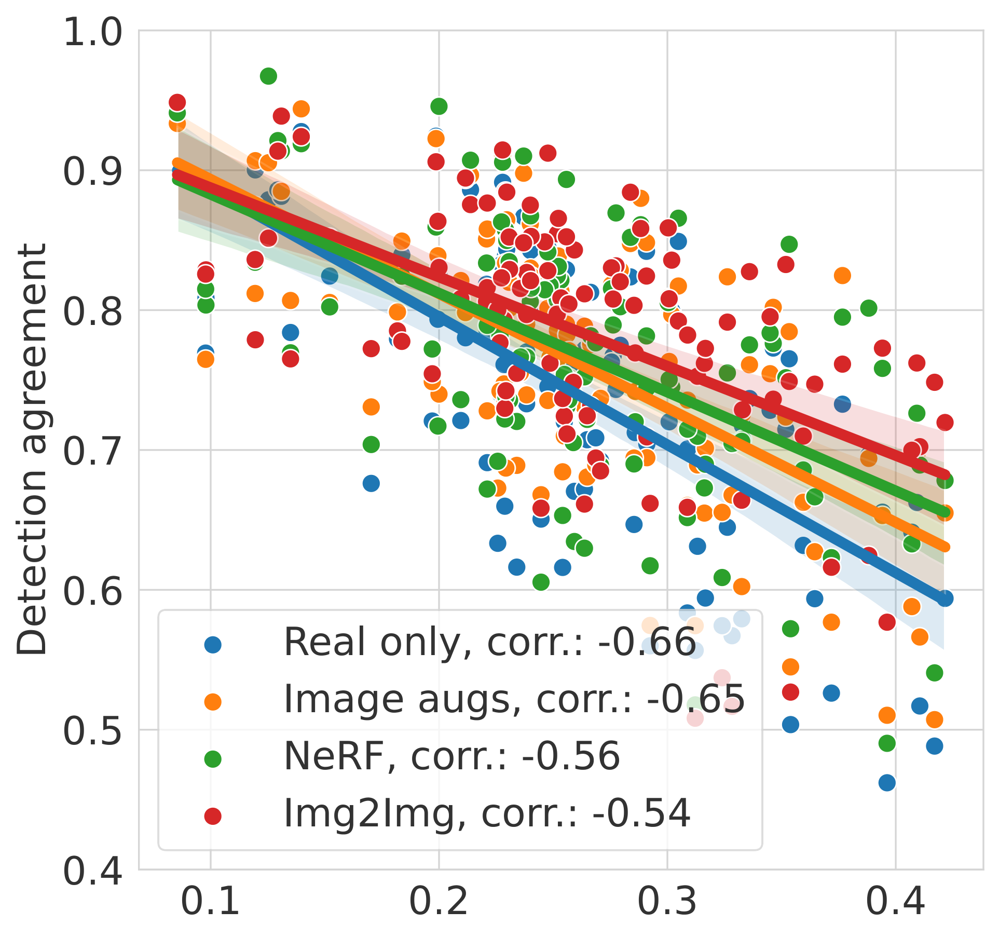
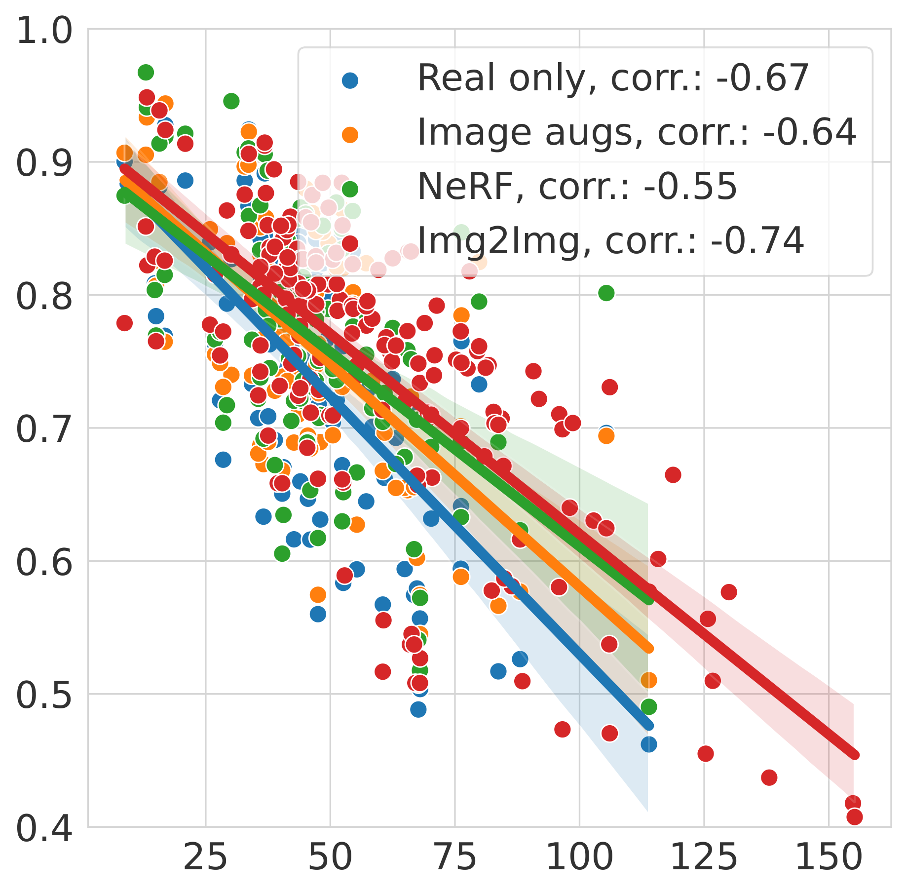

# Core idea
We study the real-to-simulated data gap in autonomous driving, specifically how models trained on real data perceive NeRF-rendered data. We find that there is a notable drop in performance for multiple perception models on images produced by a SOTA neural rendering method <d-cite key="tonderski2023neurad"></d-cite>. To close this gap, **we focus on improving the robustness of perception models**, and find that fine-tuning with selected data augmentations can significantly improve performance on NeRF-rendered data without compromising real-world performance.

# Abstract
Neural Radiance Fields (NeRFs) have emerged as promising tools for advancing autonomous driving (AD) research, offering scalable closed-loop simulation and data augmentation capabilities. However, to trust the results achieved in simulation, one needs to ensure that AD systems perceive real and rendered data in the same way. Although the performance of rendering methods is increasing, many scenarios will remain inherently challenging to reconstruct faithfully. To this end, we propose a novel perspective for addressing the real-to-simulated data gap. Rather than solely focusing on improving rendering fidelity, we explore simple yet effective methods to enhance perception model robustness to NeRF artifacts without compromising performance on real data. Moreover, we conduct the first large-scale investigation into the real-to-simulated data gap in an AD setting using a state-of-the-art neural rendering technique. Specifically, we evaluate object detectors and an online mapping model on real and simulated data, and study the effects of different pre-training strategies. Our results show notable improvements in model robustness to simulated data, even improving real-world performance in some cases. Last, we delve into the correlation between the real-to-simulated gap and image reconstruction metrics, identifying FID and LPIPS as strong indicators.

---

# Method

To reduce the real2sim gap, we propose to make perception models more robust toward NeRF artifacts. Given already trained models, we fine-tune them on 3 different types of augmentations: hand-crafted image augmentations, NeRF-data, and img2img methods. As training NeRFs on many sequences is expensive, we do so only for a subset of the data. For this subset, we also train a img2img model <d-cite key="wang2018high"></d-cite> to predict the NeRF data from the real data. This way, we can generate more NeRF-like data for fine-tuning. After fine-tuning, we evaluate the models on both real and NeRF data and compare the results. See Fig 1 for an overview of the pipeline, and Fig 2 for example augmentations.

<figure>
  
  <figcaption><b>Fig 1</b>. Left: Pipeline for making perception models more robust toward NeRF artifacts. Right: Evaluation of real2sim gap. </figcaption>
</figure>

<figure>
  
  
  
  
  <figcaption><b>Fig 2</b>. Example for different augmentations. From top-left: original, image augmentation, NeRF-data, img2img method.</figcaption>
</figure>

# Results

We evaluate three 3D object detectors <d-cite key="wang2021fcos3d"></d-cite><d-cite key="liu2022petr"></d-cite><d-cite key="li2022bevformer"></d-cite> and an online mapping model <d-cite key="liao2023maptrv2"></d-cite> on both real and NeRF data. We find that without fine-tuning, the models perform significantly worse on NeRF data compared to real data. However, after fine-tuning, all models improve notably on the NeRF data, and in some cases even increase in performance on real data. This indicates that the models have become more robust toward NeRF artifacts. We also find that the img2img method is the most effective augmentation method, followed by NeRF-data and image augmentation.

## 3D Object Detection

Below, we show nuScenes detection score (NDS) for the 3D object detectors trained on real data, fine-tuned with different augmentations, and evaluated on both real and simulated data. We see that all models improve on the NeRF data after fine-tuning. For both FCOS3D and BEVFormer, the img2img method can reduce the real2sim gap beyond simply adding NeRF data to the fine-tuning. 

<figure>
  
  <figcaption><b>Fig 3</b>. NDS for 3D object detectors trained on real data, fine-tuned with different augmentations, and evaluated on both real and simulated (NeRF-generated) data.</figcaption>
</figure>

## Online mapping

The video below shows the performance of the online mapping model on real data, NeRF-data from the same view point, and NeRF-data when rotating the ego-vehicle by different amounts (ccw=counterclockwise, cw=clockwise). The left video shows how predictions degrade as the rotation increases, even though the model has been fine-tuned with NeRF data. While the poor performance to some degree can be attributed to worse rendering quality, we also theorize that these types of scenes, with a large attack angle toward lane-markers, are rare in the perception model training data. Thus, we further fine-tune the model with rotated images (right), which significantly improves the performance on rotated NeRF data.

<div style="display: flex; align-items: center; justify-content: center;">
  <video controls autoplay loop muted playsinline style="width: 100%;">
    <source src="stacked.webm" type="video/webm">
  </video>
</div>

## NVS metrics vs. real2sim gap

We find that the real2sim gap (defined as detection agreement between predictions on real vs NeRF data) correlates well with the FID and LPIPS metrics. The figure below shows the correlation between the real2sim gap and the FID and LPIPS metric for the object detectors, for different fine-tuning methods. This indicates that such learned perceptual metrics can be used as a proxy to evaluate the real2sim gap. Further, we see that our proposed fine-tuning methods mainly increase detection agreement when rendering quality is low (high FID and LPIPS).

<figure>
  
  
  <figcaption><b>Fig 4</b>. Detection agreement vs. novel view synthesis metrics for BEVFormer fine-tuned with different augmentations. Left: LPIPS, right: FID.</figcaption>
</figure>

--- 

# BibTeX
```bibtex
@article{lindstrom2024real2sim,
  title     = {Are NeRFs ready for autonomous driving? Towards closing the real-to-simulation gap},
  author    = {Carl Lindstr{\"o}m, Georg Hess, Adam Lilja, Maryam Fatemi, Lars Hammarstrand, Christoffer Petersson, Lennart Svensson},
  journal   = {arXiv preprint arXiv:2403.16092},
  year      = {2024}
}
```

