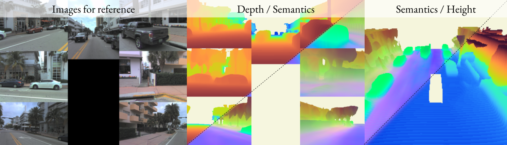
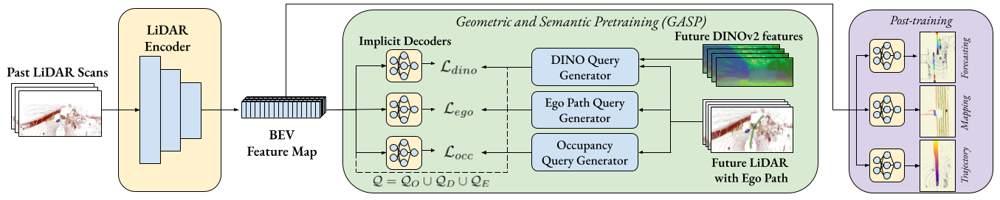
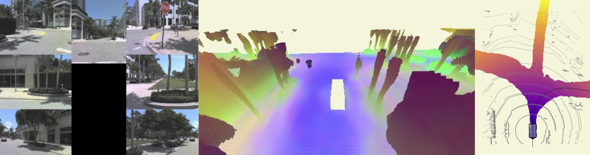
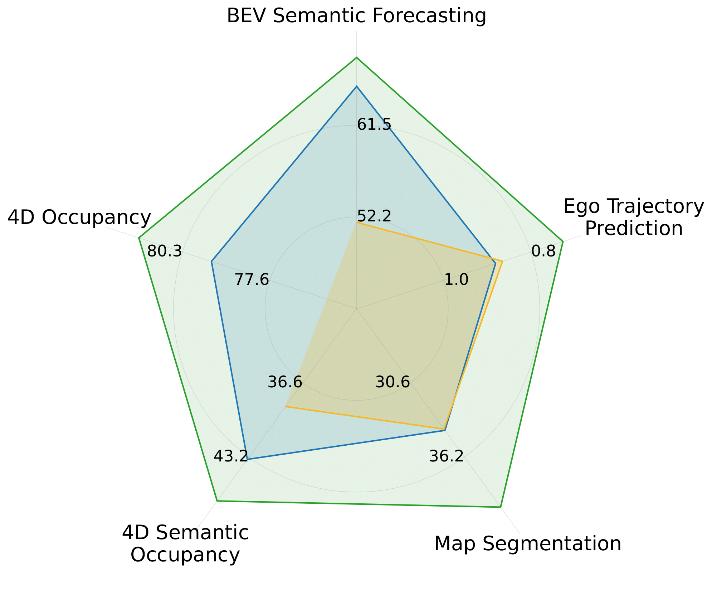

<div style="text-align: center; margin-bottom: 1em;">
<h1>TLDR</h1>
<p style="font-weight: 500; width: 70%; margin: 0 auto;">
We learn a unified representation by predicting general occupancy, ego occupancy, and distilled high-level features from a vision foundation model in a continuous 4D field a self-supervised manner. 
In doing so, we learn representation better aligned for multiple downstream tasks in autonomous driving.
</p>
</div>

<figure class="figure__background">
  
</figure>

---

# Abstract
Self-supervised pre-training based on next-token prediction has enabled large language models to capture the underlying structure of text, and has led to unprecedented performance on a large array of tasks when applied at scale. Similarly, autonomous driving generates vast amounts of spatiotemporal data, alluding to the possibility of harnessing scale to learn the underlying geometric and semantic structure of the environment and its evolution over time. In this direction, we propose a **g**eometric **a**nd **s**emantic self-supervised **p**re-training method, GASP, that learns a unified representation by predicting, at any queried future point in spacetime, (1) general occupancy, capturing the evolving structure of the 3D scene; (2) ego occupancy, modeling the ego vehicle path through the environment; and (3) distilled high-level features from a vision foundation model. By modeling geometric and semantic 4D occupancy fields instead of raw sensor measurements, the model learns a structured, generalizable representation of the environment and its evolution through time. We validate GASP on multiple autonomous driving benchmarks, demonstrating significant improvements in semantic occupancy forecasting, online mapping, and ego trajectory prediction. Our results demonstrate that continuous 4D geometric and semantic occupancy prediction provides a scalable and effective pre-training paradigm for autonomous driving.


# Method 
We build upon UnO <d-cite key="agro2024uno"></d-cite> and learn to predict 4D occupancy fields. While we can learn a lot about geometry and dynamics from solely lidar supervision, we also want to learn high-level semantic features as they are crucial for downstream tasks. We therefore distill high-level features from a vision foundation model and predict them in the same way as the occupancy fields. This way, we learn a unified representation that captures both the geometric and semantic structure of the environment.
<figure class="figure__background">
  
  <figcaption><b>Fig 2.:</b> Overview of GASP.</figcaption>
</figure>

# Results
## Qualitative Results
**Fun things first.** Lets look at some visualizations of the learned representation. In all of these visualizations we've reduced the 4D semantic features to 2D using PCA and then projected them to the camera view and holistic view.

<div>
<video controls autoplay loop muted style="width: 100%;">
  <source src="assets/qual1.mp4" type="video/mp4">
  Your browser does not support the video tag.
</video>
<figcaption><b>Fig 1.:</b> PCA reduced 4D semantic features projected to camera view and holistic view. Images are shown for reference.</figcaption>
</div>

<div>
<video controls autoplay loop muted style="width: 100%;">
  <source src="assets/qual2.mp4" type="video/mp4">
  Your browser does not support the video tag.
</video>
<figcaption><b>Fig 2.:</b> PCA reduced 4D semantic features projected to camera view and holistic view. Images are shown for reference.</figcaption>
</div>

<figure class="figure__background">
  
  <figcaption><b>Fig 3.:</b> Ego path probability in a three-way intersection together with PCA reduced semantic features.</figcaption>
</figure>

<div>
<video controls autoplay loop muted style="width: 100%;">
  <source src="assets/gasp.mp4" type="video/mp4">
  Your browser does not support the video tag.
</video>
<figcaption><b>Fig 4.:</b> Occupancy prediction overlayed with lidar input. Shows predictions into future time (3 seconds). Images and lidar input are shown for reference.</figcaption>
</div>

<div>
<video controls autoplay loop muted style="width: 100%;">
  <source src="assets/bev-view.mp4" type="video/mp4">
  Your browser does not support the video tag.
</video>
<figcaption><b>Fig 4.:</b> Semantic features probed around the ego-vehicle, shown from BEV. Images and lidar input are shown for reference.</figcaption>
</div>


## Quantitative Results
<div style="display: flex; justify-content: space-between; width=100%; align-items: top;">
  <div style="flex: 1;margin-right: 2em;">
    <p>
    To show that semantic information is <b>indeed crucial</b> for downstream tasks, we evaluate GASP on several downstream autonomous driving tasks, such as semantic occupancy forecasting, online mapping, and ego trajectory prediction. 
    We compare GASP to UnO <d-cite key="agro2024uno"></d-cite> and to training from scratch. We show consistent improvements across all tasks, demonstrating the effectiveness of GASP.
    </p>
    <ul>
      <li><b>BEV Semantic Forecasting:</b> Predicting occupancy and class over time (2D+time).</li>
      <li><b>4D Semantic Occupancy:</b> BEV Semantic Forecasting generalized to 3D (3D+time).</li>
      <li><b>4D Occupancy: </b> Class agnostic occupancy prediction (3D+time) </li>
      <li><b>Map segmentation:</b> BEV (2D) segmentation of common mapping classes (e.g., lanes and crosswalks). </li>
      <li><b>Ego Trajectory Prediction:</b> Predicting the ego-vehicles future trajectory (3D+time).</li>
    </ul>
  </div>

  <div style="width:30%; display: flex; justify-content: center; min-width: 200px;">
    <figure class="figure__background" style="margin: 0 auto;">
      
      <figcaption><b>Fig 2.:</b> Green is GASP, blue is UnO, and yellow is from scratch.</figcaption>
    </figure>
  </div>
</div>


---

# BibTeX
```bibtex
@article{ljungbergh2025gasp,
  title        = {GASP: Unifying Geometric and Semantic Self-Supervised Pre-training for Autonomous Driving},
  author       = {Ljungbergh, William and Lilja, Adam and Tonderski, Adam and Laveno Ling, Arvid and Lindstr{\"o}m, Carl and Verbeke, Willem and Fu, Junsheng and Petersson, Christoffer and Hammarstrand, Lars and Felsberg, Michael},
  journal      = {arXiv preprint arXiv:2411.16816},
  year         = {2025}
}
```
