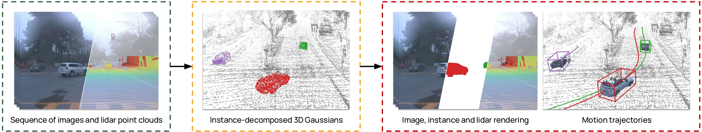
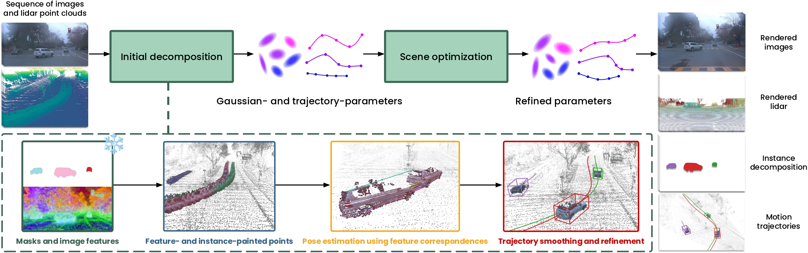
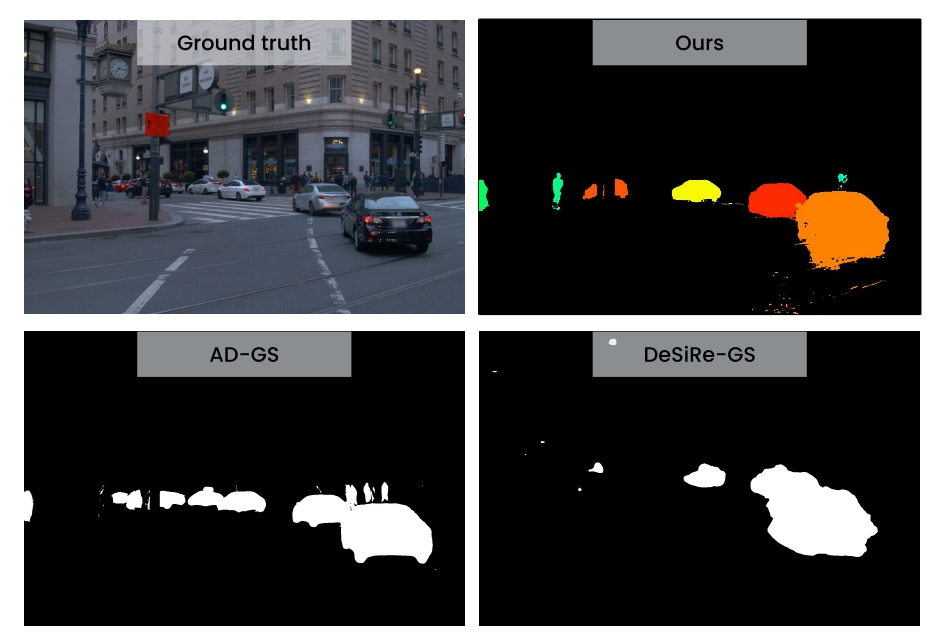
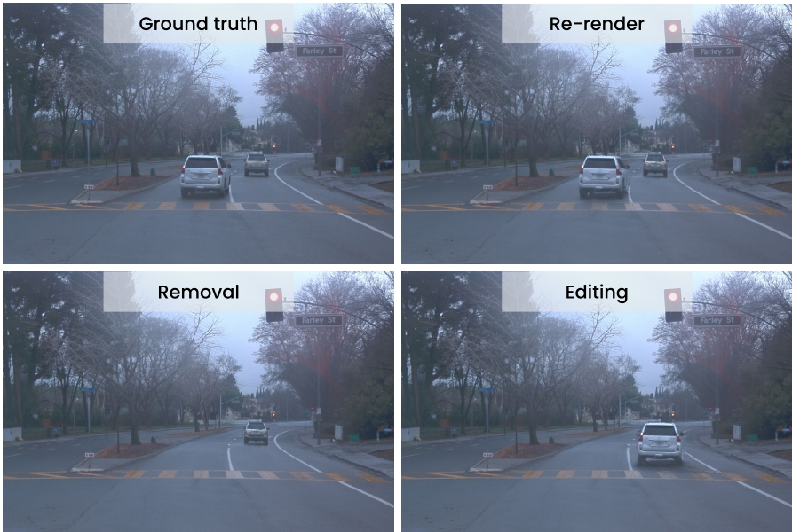

---

# Abstract
Reconstructing dynamic driving scenes is essential for developing autonomous systems through sensor-realistic simulation. Although recent methods achieve high-fidelity reconstructions, they either rely on costly human annotations for object trajectories or use time-varying representations without explicit object-level decomposition, leading to intertwined static and dynamic elements that hinder scene separation. We present IDSplat, a self-supervised 3D Gaussian Splatting framework that reconstructs dynamic scenes with explicit instance decomposition and learnable motion trajectories, without requiring human annotations. Our key insight is to model dynamic objects as coherent instances undergoing rigid transformations, rather than unstructured time-varying primitives. For instance decomposition, we employ zero-shot, language-grounded video tracking anchored to 3D using lidar, and estimate consistent poses via feature correspondences. We introduce a coordinated-turn smoothing scheme to obtain temporally and physically consistent motion trajectories, mitigating pose misalignments and tracking failures, followed by joint optimization of object poses and Gaussian parameters. Experiments on the Waymo Open Dataset demonstrate that our method achieves competitive reconstruction quality while maintaining instance-level decomposition and generalizes across diverse sequences and view densities without retraining, making it practical for large-scale autonomous driving applications. Code will be released.

<figure class="figure__background">
  
</figure>

---

# Method

IDSplat takes a sequence of images and lidar point clouds as input and produces a fully instance-decomposed 3D reconstruction of the scene which provides images, lidar, instance masks, and object trajectories. The method proceeds in two stages. First, an initial scene decomposition is obtained by lifting zero-shot 2D instance masks into 3D using lidar, estimating object trajectories via registration using features from DINOv3, and refining those trajectories through iterative coordinated-turn smoothing. Second, all Gaussian and trajectory parameters are then optimized jointly.

<figure class="figure__background">
  
</figure>

---

# Instance decomposition

To decompose the scene into object instances without any human annotations, IDSplat uses Grounded-SAM-2 to generate instance masks in a zero-shot manner with language prompts. These 2D masks are lifted into 3D by projecting lidar points onto the image plane and assigning them the corresponding instance IDs. Initial object poses are estimated by registering each instance's lidar points across frames using RANSAC. 

<figure class="figure__background">
  
</figure>

---

# Trajectory smoothing

Pose estimates from RANSAC are inevitably noisy as instance masks may be missing in some frames and lidar observations can be sparse or incomplete. To obtain reasonable trajectories, IDSplat refines the initial poses through a coordinated turn (CT) smoothing process. The final joint optimization further refines the trajectories using the rendering losses. 

---

# Results

We evaluate IDSplat across four experimental settings, each following the setup of a prior work (DeSiRe-GS, AD-GS, CoDa-4DGS, and SplatFlow). Comparing against annotation-free methods, IDSplat achieves state-of-the-art performance across all settings, and even matches annotation-based baselines on several metrics.

<style>
.rank-1 { background: rgb(255, 179, 179); }
.rank-2 { background: rgb(255, 217, 179); }
.rank-3 { background: rgb(255, 255, 179); }
</style>

<div class="pub-table-wrap">
<table>
<thead>
<tr>
  <th colspan="2">Method</th>
  <th>Anno. free</th>
  <th>PSNR ↑</th>
  <th>SSIM ↑</th>
  <th>LPIPS ↓</th>
  <th>DPSNR ↑</th>
</tr>
</thead>
<tbody>
<tr>
  <td rowspan="2"><div class="rotate">DeSiRe-GS setting</div></td>
  <td>MARS</td><td>✗</td><td>26.61</td><td>—</td><td>—</td><td>22.21</td>
</tr>
<tr>
  <td>SplatAD</td><td>✗</td><td>30.80</td><td>0.900</td><td>0.160</td><td>28.97</td>
</tr>
<tr class="sep-above">
  <td rowspan="5"></td>
  <td>PVG</td><td>✓</td><td class="rank-2">29.77</td><td>—</td><td>—</td><td class="rank-2">27.19</td>
</tr>
<tr>
  <td>EmerNeRF</td><td>✓</td><td>25.14</td><td>—</td><td>—</td><td>23.49</td>
</tr>
<tr>
  <td>S3Gaussian</td><td>✓</td><td>27.44</td><td>—</td><td>—</td><td>22.92</td>
</tr>
<tr>
  <td>DeSiRe-GS</td><td>✓</td><td class="rank-3">28.76</td><td class="rank-2">0.873</td><td class="rank-2">0.193</td><td class="rank-3">26.26</td>
</tr>
<tr>
  <td><strong>IDSplat (ours)</strong></td><td>✓</td><td class="rank-1"><strong>30.83</strong></td><td class="rank-1"><strong>0.900</strong></td><td class="rank-1"><strong>0.160</strong></td><td class="rank-1"><strong>29.20</strong></td>
</tr>

<tr class="sep-above">
  <td rowspan="4"><div class="rotate">AD-GS setting</div></td>
  <td>StreetGS</td><td>✗</td><td>33.97</td><td>0.926</td><td>0.227</td><td>28.50</td>
</tr>
<tr>
  <td>4DGS</td><td>✗</td><td>34.64</td><td>0.940</td><td>0.244</td><td>29.77</td>
</tr>
<tr>
  <td>SplatAD</td><td>✗</td><td>34.24</td><td>0.925</td><td>0.246</td><td>29.68</td>
</tr>
<tr>
  <td>SplatAD (CasTrack)</td><td>✗</td><td>32.52</td><td>0.924</td><td>0.241</td><td>25.31</td>
</tr>
<tr class="sep-above">
  <td rowspan="5"></td>
  <td>PVG</td><td>✓</td><td>29.54</td><td>0.895</td><td>0.266</td><td>21.56</td>
</tr>
<tr>
  <td>EmerNeRF</td><td>✓</td><td>31.32</td><td>0.881</td><td>0.301</td><td>21.80</td>
</tr>
<tr>
  <td>Grid4D</td><td>✓</td><td class="rank-3">32.19</td><td class="rank-1">0.921</td><td class="rank-3">0.253</td><td class="rank-3">22.77</td>
</tr>
<tr>
  <td>AD-GS</td><td>✓</td><td class="rank-2">33.91</td><td class="rank-1">0.927</td><td class="rank-1">0.228</td><td class="rank-2">27.41</td>
</tr>
<tr>
  <td><strong>IDSplat (ours)</strong></td><td>✓</td><td class="rank-1"><strong>34.59</strong></td><td class="rank-1"><strong>0.929</strong></td><td class="rank-2"><strong>0.235</strong></td><td class="rank-1"><strong>29.63</strong></td>
</tr>

<tr class="sep-above">
  <td rowspan="2"><div class="rotate">CoDa</div></td>
  <td>CoDa-4DGS</td><td>✓</td><td class="rank-2">28.66</td><td class="rank-2">0.900</td><td class="rank-1">0.058</td><td>—</td>
</tr>
<tr>
  <td><strong>IDSplat (ours)</strong></td><td>✓</td><td class="rank-1"><strong>30.50</strong></td><td class="rank-1"><strong>0.875</strong></td><td class="rank-2"><strong>0.090</strong></td><td>—</td>
</tr>

<tr class="sep-above">
  <td rowspan="2"><div class="rotate">SplatFlow</div></td>
  <td>SplatFlow</td><td>✓</td><td class="rank-2">28.71</td><td class="rank-2">0.874</td><td class="rank-2">0.239</td><td>—</td>
</tr>
<tr>
  <td><strong>IDSplat (ours)</strong></td><td>✓</td><td class="rank-1"><strong>29.95</strong></td><td class="rank-1"><strong>0.879</strong></td><td class="rank-1"><strong>0.183</strong></td><td>—</td>
</tr>
</tbody>
</table>
<p class="table-note">NVS results across multiple evaluation settings. Dashed lines separate annotation-based from annotation-free methods. <span style="background:rgb(255,179,179);padding:0 0.3em;">1st</span> <span style="background:rgb(255,217,179);padding:0 0.3em;">2nd</span> <span style="background:rgb(255,255,179);padding:0 0.3em;">3rd</span> among annotation-free methods.</p>
</div>

The figure below shows comparisons of novel view synthesis over different view densities (25%, 50%, and 75% of training frames) on the dynamic subset of the Waymo NOTR dataset. Our instance-decomposed representation enables high-quality rendering of dynamic objects even when trained with sparse viewpoints.

<figure class="figure__background">
  
</figure>

---

# Scene manipulation

Because each dynamic object in IDSplat is represented as an independent instance, the reconstructed scene is fully decomposable and editable. Individual objects can be removed from the scene entirely, repositioned along new trajectories, or replaced, without re-optimizing the background or other instances. This makes IDSplat directly useful for closed-loop simulation. Collected data can be transformed into safety-critical scenarios simply by modifying actor trajectories. Combined with the method's zero-shot generalization across datasets and object classes, this positions IDSplat as a significant step towards scalable autonomous driving simulation.

<figure class="figure__background">
  
</figure>

---

# BibTeX

```bibtex
@misc{lindström2026idsplatinstancedecomposed3dgaussian,
      title={IDSplat: Instance-Decomposed 3D Gaussian Splatting for Driving Scenes}, 
      author={Carl Lindström and Mahan Rafidashti and Maryam Fatemi and Lars Hammarstrand and Martin R. Oswald and Lennart Svensson},
      year={2026},
      eprint={2511.19235},
      archivePrefix={arXiv},
      primaryClass={cs.CV},
      url={https://arxiv.org/abs/2511.19235}, 
}
```