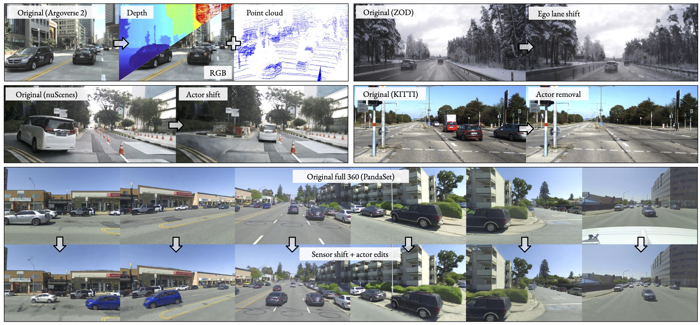
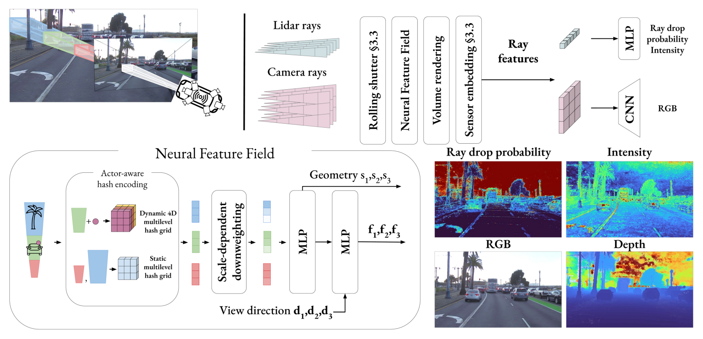

  <video controls autoplay loop muted playsinline style="width: 70vw;">
    <source src="suppvideo.webm" type="video/webm">
  </video>

---

# Abstract
Neural radiance fields (NeRFs) have gained popularity in the autonomous driving (AD) community. Recent methods show NeRFs' potential for closed-loop simulation, enabling testing of AD systems, and as an advanced training data augmentation technique. However, existing methods often require long training times, dense semantic supervision, or lack generalizability. This, in turn, hinders the application of NeRFs for AD at scale. In this paper, we propose NeuRAD, a robust novel view synthesis method tailored to dynamic AD data. Our method features simple network design, extensive sensor modeling for both camera and lidar --- including rolling shutter, beam divergence and ray dropping --- and is applicable to multiple datasets out of the box. We verify its performance on five popular AD datasets, achieving state-of-the-art performance across the board. To encourage further development, we openly release the NeuRAD source code.

<figure class="figure__background">
  
</figure>

---

# Method

<figure class="figure__background">
  
</figure>

The core of NeuRAD is a Neural Feature Field (NFF), a generalization of NeRFs and similar approaches. The NFF is a function \\(F(\mathbf{x}, t, \mathbf{d})\\) that maps a 3D point at a current time \\(\mathbf{x_i}, t_i\\), and a direction \\(\mathbf{d_i}\\) to a geometry descriptor \\(s_i\\) and a feature vector \\(\mathbf{f_i}\\). We then use volume rendering to generate per-ray features \\(\mathbf{f}\\) and expected depth. For lidar rays we use a small MLP to predict the probability that the ray did not return (ray drop), as well as the intensity of the return. For camera rays, we arrange features into a patch, and use a small ConvNet to predict the RGB color of the patch.

Crucially, we apply a number of sensor-specific modeling techniques to improve the rendering quality. These are described in more detail below.

## Rolling Shutter

Rolling shutter is caused by the fact that both cameras and lidars typically do not capture the entire scene at the same time. Instead, they capture the scene sequentially, one row at a time for images, and in a rotating manner around the height axis for a 360-spinning lidar. This means that each pixel and lidar point has an individual timestamp, and it is especially problematic for dynamic scenes, as the scene can change significantly between the first and last measurement in a given scan.

To compensate for this effect we explicitly assign individual timestamps to each pixel and lidar point, and adjust the ray origin and direction accordingly by linearly interpolating the sensor pose. We additionally interpolate the poses for all dynamic actors in the scene as well. The impact of this detailed modelling is shown below:




## Ray divergence

Recent work has shown that NeRFs suffer from aliasing artifacts when objects in the scene are viewed at different distances. This is especially problematic in automotive scenes, where the sensors (ego vehicle) moves through the scene, and the distance to the objects in the scene changes. Inspired by recent work <d-cite key="Barron_2023_ICCV"></d-cite>, we model the beam divergence of the lidar sensor, and the size of individual pixels, by reweighting the iNGP hashgrid features. Specifically, for a given ray sample, we compare the volume of the frustum it represents, with the volume of a voxel at each resolution of the hashgrid. We then downweight features for scales that are much smaller than the considered frustum.

Note that this formulation is different from prior work, where the downweighting is based on Gaussians, and the hashgrid is sampled multiple time, incurring a significant computational overhead. In contrast, our formulation is simpler and faster, but expressive. Still, we find that it significantly improves the rendering quality, and especially the depth estimation.

## Sensor embeddings

An autonomous vehicle typically records the scene using multiple cameras, which can differ quite a bit. Sometimes they are entirely different models, and sometimes they are the same model, but with different settings. Even with all settings being equal dynamic adjustments of the sensor parameters, such as exposure time, can cause the same camera to capture the same scene differently. This results in inconsistencies in the data, which is highly problematic for the RGB reconstruction loss. To address this, we concanetate a learnable sensor embedding to the rendered feature \\(\mathbf{f}\\), before modality decoders. This allows the network to learn to compensate for the differences in the sensors, and results in a more consistent reconstruction, as is illustrated below:



Note that this is inspired by recent work on NeRFs in the wild <d-cite key="martin2021nerf"></d-cite>, with two key differences. First, we only learn a single embedding per sensor, not per image, improving generalizaiton to novel views. Second, we apply the sensor embedding after the volume rendering, reducing the computational overhead. This is not possible in the original work, as they directly render RGB, whereas we render high-level features.

---