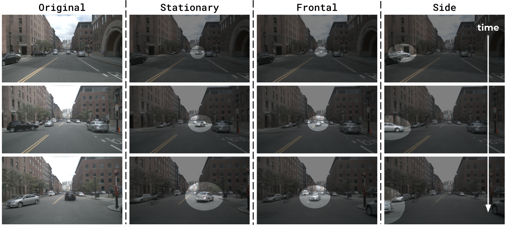
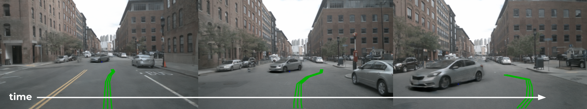
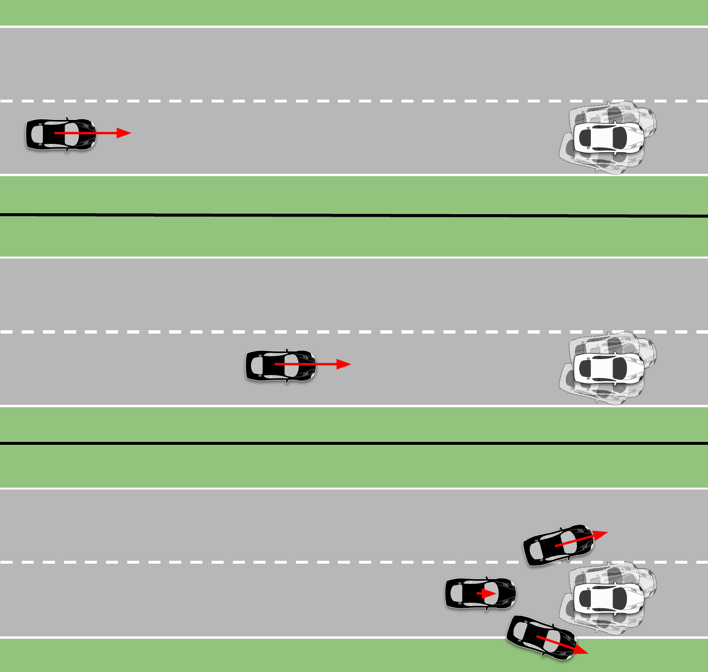
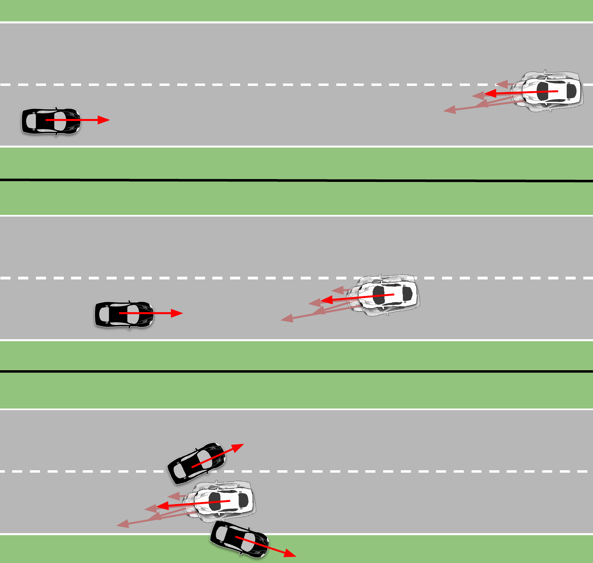
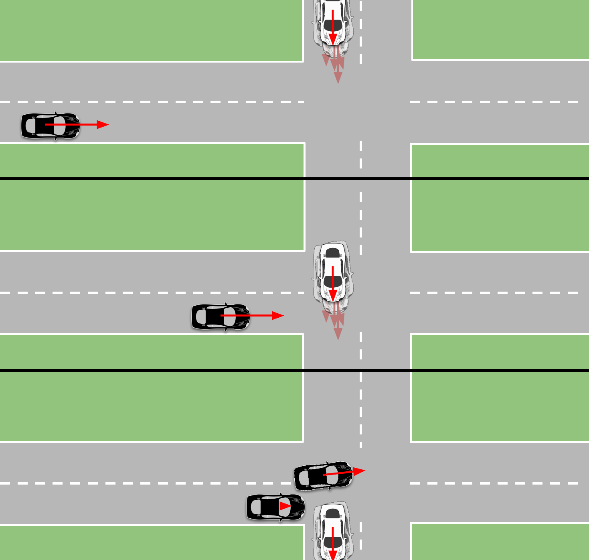
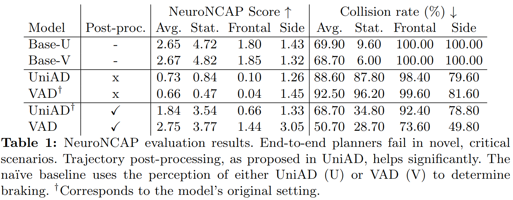
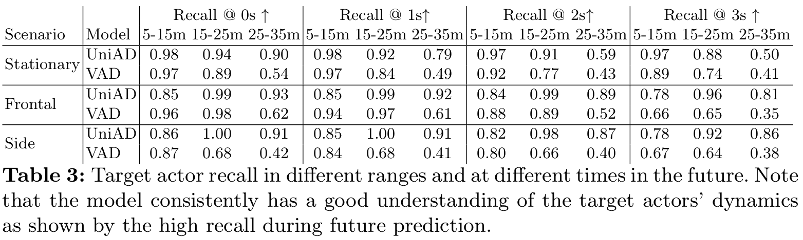
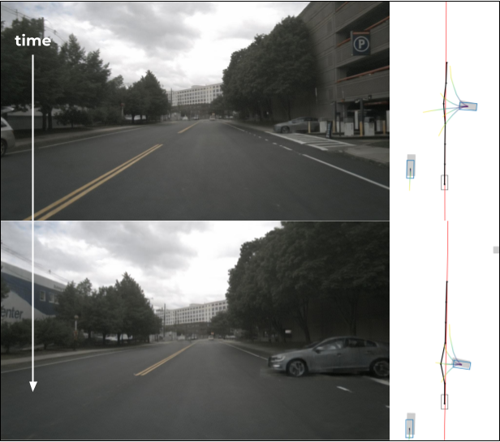

# Core idea
The core idea in NeuroNCAP is to **leverage NeRFs** for autonomous driving <d-cite key="tonderski2023neurad"></d-cite> **to realistically simulate safety-critical scenarios** from a sequence of real-world data **and evaluate end-to-end AD systems in closed-loop**. To this end, we release an **open-source framework**, and evaluate two state-of-the-art end-to-end planners, UniAD <d-cite key="hu2023planning"></d-cite> and VAD <d-cite key="jiang2023vad"></d-cite>, on our safety-critical NeuroNCAP scenarios. We find that they **fail to avoid collisions**, even though they accurately perceive the safety-critical actor. We hope that NeuroNCAP will be used as a **benchmark for evaluating the safety of autonomous driving models**.

  <video controls loop muted playsinline style="width: 70%;" poster="assets/neuro-ncap-logo.png">
    <source src="assets/videos/teaser-video.mp4" type="video/mp4">
  </video>

---

# Abstract
We present a versatile NeRF-based simulator for testing autonomous driving (AD) software systems, designed with a focus on sensor-realistic closed-loop evaluation and the creation of safety-critical scenarios. The simulator learns from sequences of real-world driving sensor data and enables reconfigurations and renderings of new, unseen scenarios. In this work, we use our simulator to test the responses of AD models to safety-critical scenarios inspired by the [European New Car Assessment Programme](https://www.euroncap.com/en) (Euro NCAP). Our evaluation reveals that, while state-of-the-art end-to-end planners excel in nominal driving scenarios in an open-loop setting, they exhibit critical flaws when navigating our safety-critical scenarios in a closed-loop setting. This highlights the need for advancements in the safety and real-world usability of end-to-end planners. By publicly releasing our simulator and scenarios as an easy-to-run evaluation suite, we invite the research community to explore, refine, and validate their AD models in controlled, yet highly configurable and challenging sensor-realistic environments. Code is available at [https://github.com/wljungbergh/NeuroNCAP](https://github.com/wljungbergh/NeuroNCAP)

---

In <b>Fig. 1</b> below we show an original [nuScenes](https://www.nuscenes.org/) sequence (#0103), followed by examples of our three types of NeuroNCAP scenarios: <i>stationary</i>, <i>frontal</i>, and <i>side</i>. The inserted safety-critical actor has been highlighted for illustration purposes. We can generate hundreds of unique scenarios from each sequence by selecting different actors, jittering their trajectories, and choosing different starting conditions for the ego vehicle.

  

    
    <figcaption><b>Fig 1.:</b> The original sequence and multiple NeuroNCAP scenarios with the inserted safety critical actor highlighted.</figcaption>
  

Once a scenario has been instantiated, we can run an entire AD system in closed-loop, as shown in <b>Fig. 2</b>. Here we show an example of UniAD <d-cite key="hu2023planning"></d-cite> planning and executing a trajectory in a stationary collision scenario. The system successfully avoids the collision by steering away from the safety-critical actor.

  

    
    <figcaption><b>Fig 2.:</b> An AD system plans <b>and execute</b> a trajectory in closed-loop, here showing UniAD<d-cite key="hu2023planning"></d-cite>.</figcaption>
  

---

# Closed-loop Simulator

Our closed-loop simulator repeatedly performs four steps (illustrated below):
1. The **Neural Renderer** generates high-quality sensor data. The renderer is trained on a sequence of real-world driving data.
2. The **AD Model** predicts a future ego-vehicle trajectory given the rendered camera input and the ego-vehicle state.
3. The **Controller** converts the planned trajectory to a set of acceleration and steering signals.
4. The **Vehicle Model** propagates the ego-state forward in time, based on the control inputs.

<figure class="figure__background">
  
</figure>

---

# NeuroNCAP Evaluation Protocol
In contrast to common evaluation practices – i.e., averaging performance across large-scale datasets – NeuroNCAP instead **focuses on a small set of carefully designed safety-critical scenarios**, designed such that any model that cannot successfully handle all of them, should be considered unsafe.
### Creating safety-critical scenarios

  

   To create safety-critical, we have taken inspiration from the industry standard <a href="https://www.euroncap.com/">Euro NCAP</a> testing and define three types of scenarios, each characterized by the behavior of the actor that we are about to collide with: <i>stationary</i>, <i>frontal</i>, and <i>side</i>.
   

   

   In the stationary scenario, the actor is stationary in the current ego-vehicle trajectory, while in the frontal and side scenarios, the actor is moving towards the ego vehicle in a frontal or side collision course, respectively. In the stationary and side scenarios, a collision can be avoided either by stopping or by steering, while in the frontal scenario, a collision can only be avoided by steering.
  

  
  <figcaption>(a) Stationary</figcaption>

  
  <figcaption>(b) Frontal</figcaption>

  
  <figcaption>(c) Side</figcaption>

### Creating *photo-realistic* safety-critical scenarios
From a sequence of real-world driving data, we train a neural rendering model <d-cite key="tonderski2023neurad"></d-cite> thus obtaining a digital clone of the original sequence. Subsequently, we can easily alter the scene (by moving/adding/removing actors) to create a safety-critical scenario and use the trained neural renderer to obtain photorealistic sensor data from new viewpoints. Below we show an example of a frontal collision scenario, where we have first **removed all the other actors** and then **inserted a safety-critical actor on a collision course** with the ego vehicle. The safety-critical actor was chosen to be the white/orange truck on the left of the original sequence.




### Creating *countless* photo-realistic safety-critical scenarios
We can generate multiple random instances from the same scenario by simply jittering attributes such as position and rotation, as well as the actor itself. Below we show three random runs of the same stationary scenario. Note that in the first two, we have maintained the same actor, while in the third we have changed the actor. Note that all of these scenarios are run in closed-loop, with UniAD <d-cite key="hu2023planning"></d-cite> as the driving system.

  <video controls autoplay loop muted playsinline style="width: 100%;">
    <source src="assets/videos/stationary-compressed-concat.mp4" type="video/mp4">
    <source src="assets/videos/stationary-compressed-concat.webm" type="video/webm">
  </video>

<figcaption style="width: 100%;"> Three random runs of the same stationary scenario. </figcaption>

### Scoring safety-critical scenarios
For each scenario, a score is computed. A full score is achieved only by completely avoiding collision. Partial scores are awarded by successfully reducing the impact velocity. In spirit of the [5-star Euro NCAP rating system](https://www.euroncap.com/en/about-euro-ncap/how-to-read-the-stars/) we compute the NeuroNCAP score (NNS) as

$$
    \text{NNS} =
    \begin{cases}
        5.0                                    & \text{if no collision} \\
        4.0 \cdot \text{max}(0, 1 - v_i / v_r) & \text{otherwise}
    \end{cases}\enspace
$$

where $$v_i$$ is the impact speed as the magnitude of relative velocity between the ego-vehicle and the colliding actor, and $$v_r$$ is the reference impact speed that would occur if no action is performed. In other words, the score corresponds to a 5-star rating if a collision is entirely avoided, and otherwise, the rating is linearly decreased from four to zero stars at (or exceeding) the reference impact speed.

---

# Evaluating state-of-the-art models in NeuroNCAP
We evaluate the performance of two state-of-the-art end-to-end planners, UniAD <d-cite key="hu2023planning"></d-cite> and VAD <d-cite key="jiang2023vad"></d-cite>, in the NeuroNCAP scenarios. We find that the post-processing (classical solver based on future occupancy) used in UniAD increases the performance in the safety-critical scenarios and that without it, the models fail completely. Find more details of this evaluation in the paper.

  

    
  

 

Below we show an example of a frontal collision scenario, where both UniAD and VAD are run both with and without the post-processing step. In this case, all fail except for UniAD with post-processing.

  <video controls loop muted playsinline style="width: 70%;">
    <source src="assets/videos/multi-model-frontal-0110.mp4" type="video/mp4">
  </video>

 
One might think that the reason that the models perform so poorly is due to a sim-to-real gap. To investigate this, we performed a sim-to-real study, where we made use of the auxiliary outputs (detected and forecasted objects), and computed how well the models perceive the safety-critical actor. As shown in the table below, the models accurately detect and forecast the safety-critical actor, but still fail to avoid the collision.

  

    
  

 

In the figure below we show a qualitative example of this. In this side-scenario, UniAD correctly detects and forecasts the actor. As seen, it predicts many possible trajectories for the actor, several of which are driving straight into our trajectory. Despite this, it fails to do a safe maneuver, such as breaking or steering with sufficient safety margin, to avoid the collision.

    

---