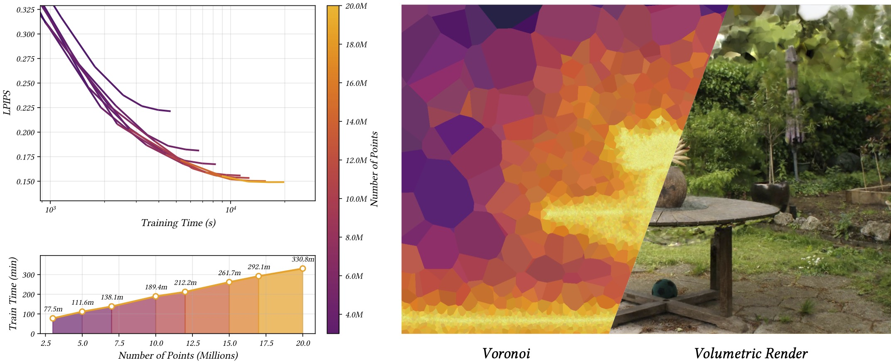
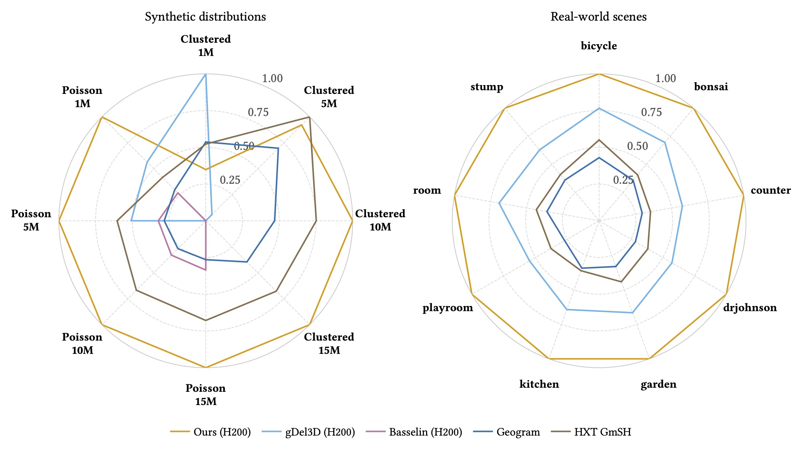

<div style="display: flex; justify-content: space-around; margin-bottom: 1em; margin-top: 0.5em; width=100%">
<figure class="figure__background">
  
  <figcaption><b>Fig 1.:</b> Scalability and perceptual quality. Our efficient construction of 3D Voronoi diagrams enables mesh-based neural rendering to scale to 20 million cells, and reveals a strong correlation between model capacity and perceptual quality. Applied to Radiant Foam on the "Garden" scene from mip-NeRF 360, total training time scales approximately linearly with the point-count limit, and higher point capacities yield better visual convergence during training.</figcaption>
</figure>
</div>

---

# Abstract
Voronoi diagrams, and their more general weighted counterpart, power diagrams, are fundamental geometric constructs with wide-ranging applications in biology, physics simulation, and computer graphics. Recently, they have gained renewed attention in mesh-based neural rendering. Despite being extensively studied, the construction of 3D Voronoi diagrams for large-scale point sets remains computationally expensive, limiting their adoption in large-scale applications. Existing CPU-based approaches typically rely on computing its dual, the Delaunay tetrahedralization, but are prohibitively slow for large diagrams, while GPU-based methods either struggle to scale efficiently to large point sets or assume homogeneous point distributions. The weighted case, power diagrams, is even less explored in this context. Existing approaches are typically tailored to the application at hand, assuming homogeneous point distributions and small weight variations, making them unsuitable for general use in more complex heterogeneous data.

In this paper, we present a highly parallelizable GPU algorithm for the fast construction of large-scale 3D Voronoi and power diagrams. Our approach constructs each convex cell from a weighted 3D point by progressively clipping an initial cell volume against bisecting planes induced by candidate neighboring points. To efficiently identify candidate neighbors under arbitrary spatial distributions, we introduce a culling criterion based on directional geometric bounds of the evolving cell, combined with a hierarchical best-first traversal of bounding volumes.

We achieve performance on par with state-of-the-art Delaunay tetrahedralization methods on small and moderate problem sizes, while exhibiting robust scalability to large point sets and diverse spatial distributions. Moreover, our method naturally generalizes to power diagrams without additional assumptions. To facilitate reproducibility and future research, the source code is available at: <a href="https://github.com/zenseact/paragram">github.com/zenseact/paragram</a>.

---

# Method

Our GPU-native algorithm for computing 3D power diagrams combines three key components:

1. **Convex cell clipping** — each cell is constructed independently by progressively clipping an initial convex volume against bisecting half-spaces induced by neighboring sites.
2. **Directional culling criterion** — a tighter geometric bound that uses the axis-aligned bounding box of the evolving cell to discard neighbors whose bisecting plane cannot intersect the cell, sharply reducing the candidate set compared to isotropic radius bounds.
3. **Hierarchical spatial data structure** — a power-augmented BVH and best-first traversal that quickly locate the relevant neighbors under arbitrary spatial distributions and weight variations.

Together, these components enable cell-oriented construction that scales to tens of millions of sites under heterogeneous point distributions.


## Interactive demo: convex cell clipping

The core construction is per-cell and embarrassingly parallel: each cell starts as a bounded convex volume (here a cube) and gets clipped by the bisecting plane of every neighbor that can reach it. Press **play** or scrub the step slider to walk through the clips in nearest-first order; drag inside the canvas to orbit the camera. Each neighbor is colored by its final role: **cyan** is the candidate just evaluated, **green** marks past clips that contribute a face to the final cell, gray marks past clips whose plane ended up shadowed by a closer one, and **purple** marks pending candidates.



## Interactive demo: directional vs. isotropic culling

Three live panels comparing three search strategies for the same site: KNN with a fixed K-nearest budget, the isotropic radius bound, and our directional bound. Pick a tab to load a different point distribution, drag any point to reposition (all panels stay in sync), set K with the slider, then press **play** or scrub the step slider to walk through the clip order. The pill that appears when a panel finishes shows how many clips that strategy needed — directional consistently terminates earliest. The **cyan** dot is the candidate just evaluated, **green** marks neighbors whose bisector contributes a face, gray marks discarded ones, and red flags binders KNN failed to admit.




---

# Results

We evaluate our method on synthetic point distributions (white noise, density gradient, and clustered) and on real-world point sets extracted from neural rendering scenes (mip-NeRF 360 and others). Our approach matches or exceeds state-of-the-art Delaunay-based methods at small and moderate scales, and consistently outperforms them as the number of sites grows and as point distributions become more heterogeneous.

<div style="display: flex; justify-content: space-around; margin-bottom: 1em; margin-top: 0.5em; width=100%">
<figure class="figure__background">
  
  <figcaption><b>Fig 2.:</b> Runtime comparison on synthetic and real-world point sets. The outer ring corresponds to the fastest method on each dataset. Our method consistently approaches the outer ring across distributions, while competitors degrade at higher point counts and non-uniform distributions.</figcaption>
</figure>
</div>

## Application to neural rendering

As a drop-in replacement for the Voronoi generation step in Radiant Foam, our method removes the computational bottleneck of explicit volumetric mesh construction during training. This allows the explicit representation to scale from a few million sites to over 20 million, with the increased capacity directly translating into improved reconstruction quality.

---

# BibTeX
```bibtex
@inproceedings{taveira2026paragram,
  title     = {Scalable GPU Construction of 3D Voronoi and Power Diagrams},
  author    = {Taveira, Bernardo and Lindstr{\"o}m, Carl and Fatemi, Maryam and Hammarstrand, Lars and Kahl, Fredrik},
  booktitle = {SIGGRAPH Conference Papers '26},
  year      = {2026},
  doi       = {10.1145/3799902.3811229}
}
```
