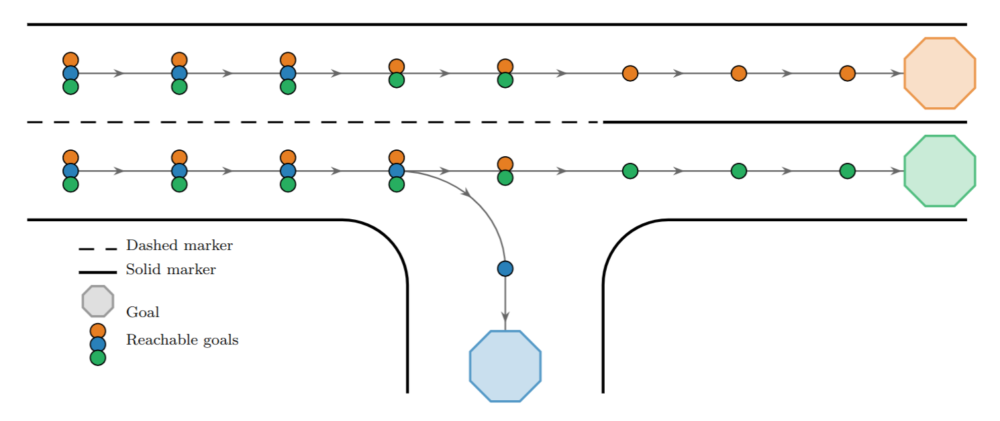
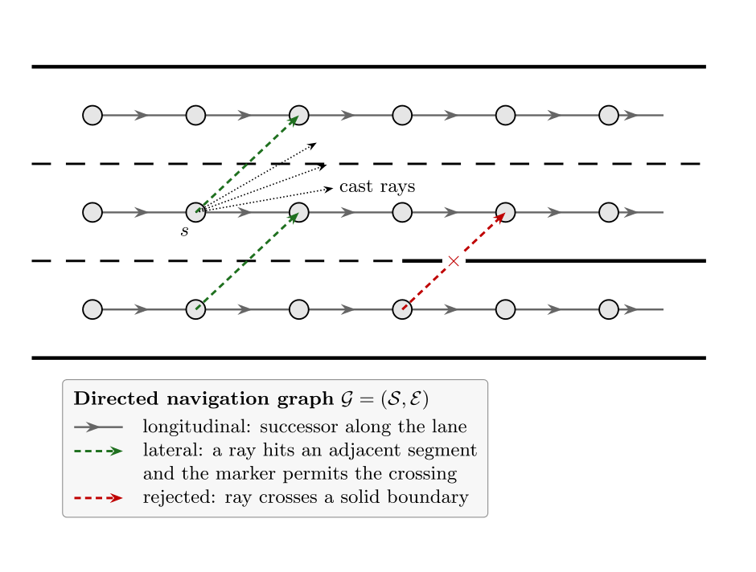
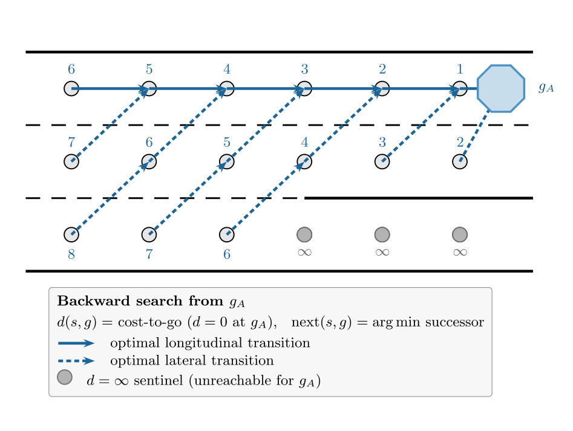
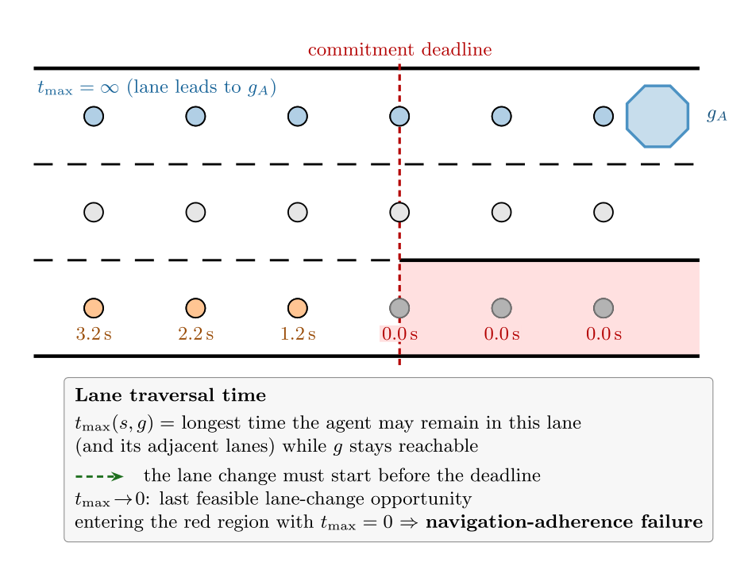
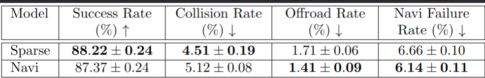
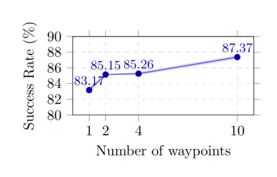

# Abstract
Hardware-accelerated driving simulators typically formulate agent goals as sparse Cartesian target positions. Although this formulation is easy to extract from logged trajectories, it provides little guidance on how a policy should reach its goal or how such goals should be sampled at deployment time. Although this approach has recently gained traction, we argue that it remains under-specified relative to how navigation is utilized in real-world systems. To address this, we propose a richer navigation interface for the open-source simulator PufferDrive. Our method precomputes a dense navigation graph consisting of waypoints and legal map-node transitions for every goal. Since this computation is performed entirely offline, the results can be cached and queried at runtime with negligible overhead; new routes can be queried efficiently when the agent deviates from the original path. In addition, we compute a lane traversal feasibility measure that indicates how long an agent can remain in its current or adjacent lane while still reaching its goal. We use this feasibility measure to define a failure criterion for adherence to navigation. Training PPO policies using PufferDrive, we show performance comparable to sparse goals without extra reward shaping or tuning.

<h1>TL;DR</h1>

A fast navigation interface implemented for the hardware accelerated self-play simulator PufferDrive<d-cite key="pufferdrive2025github"></d-cite>

# Interact with our navigation routes

The simulator below is the actual C environment from the paper, compiled to
WebAssembly and running entirely in your browser &mdash; nothing is streamed from a
server. You control the ego vehicle; the surrounding traffic replays its logged
trajectory. The overlays show the navigation routes and the lane traversal
feasibility measure described in the following sections.

  <iframe src="game/zdrive_game.html"
          title="zdrive navigation viewer"
          loading="lazy"
          style="width: 100%; aspect-ratio: 16 / 9; border: 1px solid #ddd; border-radius: 4px;">
  </iframe>

Click the viewer to focus it, then press <b>P</b> to start.
Arrow keys steer and accelerate,<b>CTRL</b> removes occlusion layer, <b>L</b> cycles lane feasibility.

# Efficient navigation construction
Since the roadgraph is static across all episodes of a given scenario, the
navigation interface can be constructed entirely offline. We precompute, for
each goal, the shortest path through the roadgraph from every map polyline, and
store the results in a compact binary cache. At runtime, the simulator loads
this cache alongside the scenario, enabling constant-time lookup of the next
map element for any given goal index. Figure 1 provides a visual
example of the resulting goal-indexed map elements.

<figure class="figure__background">
  
  <figcaption><b>Fig 1.</b> Illustration of goal reachability, where each node displays colored markers indicating which goals are reachable via the navigation graph.</figcaption>
</figure>

## Goal generation
We define a lane centerline segment as a directed pair $$s_i := (p_i^\mathrm{start}, p_i^\mathrm{end}) \in \mathcal{S} \subset \mathbb{R}^{2}\times\mathbb{R}^2$$, where $$\mathcal{S} := \{s_1, s_2, \ldots, s_N\}$$ is the discrete set with all centerline segments for a scenario. Consequently, we define the corresponding center points for the segments as $$p_i^\mathrm{center} := (p_i^\mathrm{start}+p_i^\mathrm{end})/2 \in \mathcal{P}^\mathrm{center} \subset \mathbb{R}^2$$, where $$\mathcal{P}^\mathrm{center} := \{p^\mathrm{center}_1, p^\mathrm{center}_2, \ldots, p^\mathrm{center}_N\}$$.

To generate a goal for an agent $$a$$, we consider its final position $$p_a^\mathrm{final}\in\mathbb{R}^2$$ in the scenario log, and select the centerline $$i$$ that is the closest, i.e.,

$$
i^\star = \underset{i\in\{1,\ldots,N\}}{\arg\min}\ \left\|p_a^\mathrm{final}-p_i^\mathrm{center}\right\|_2,
\tag{1}
$$

and assign the goal for agent $$a$$ as $$g_a = p_{i^\star}^\mathrm{center}\in\mathbb{R}^2$$. Having the centerline goal $$g_a$$ assigned to agent $$a$$, we must next find which segments $$s\in\mathcal{S}$$ can reach the goal by building a directed navigation graph over $$\mathcal{S}$$.

### Longitudinal connectivity
We denote by $$\mathcal{C}^\mathrm{lon}\in\{0,1\}^{N\times N}$$ the directed longitudinal connectivity matrix for the segments, i.e., if $$\mathcal{C}^\mathrm{lon}_{i,j}=1$$, then segment $$s_i$$ can reach segment $$s_j$$ by traversing the road graph. We define a connection between segment $$i$$ and $$j$$ as $$\|p_j^\mathrm{end}-p_i^\mathrm{start}\| \leq \epsilon$$, i.e.,

$$
\mathcal{C}_{i,j}^\mathrm{lon} := \begin{cases}
1 & \mathrm{if} \quad \|p_i^\mathrm{end}-p_j^\mathrm{start}\| \leq \epsilon,\\
0 & \mathrm{otherwise}.
\end{cases}
\tag{2}
$$

Note that $$\mathcal{C}^\mathrm{lon}_{i,j} = 1$$ does not necessarily imply $$\mathcal{C}^\mathrm{lon}_{j,i} = 1$$.

The longitudinal connectivity only considers segments that are directly
connected in the road graph, and not the ones that are laterally connected,
e.g., a driver must at times perform a lane change to reach their goal that
might be on an off-ramp, or a crossing left turn. Hence, we next define the
lateral connectivity matrix to account for this.

### Lateral connectivity
Similarly to $$\mathcal{C}^\mathrm{lon}_{i,j}$$, we denote by $$\mathcal{C}^\mathrm{lat}_{i,j}\in\{0,1\}^{N\times N}$$ the
directed lateral connectivity matrix. To understand which segments can be reached with a lane change from $$s_i$$, we collect only nearby adjacent segments that share a similar orientation as $$s_i$$ into the set $$\mathcal{S}_i^\mathrm{adjacent}$$. Then, to decide if a segment $$s_j^\mathrm{adjacent}\in\mathcal{S}_i^\mathrm{adjacent}$$ is connected to $$s_i$$, we mimic a potential lane change by casting a ray from $$s_i$$ with an angle

$$
\theta(t_\mathrm{lc}) = \arcsin\!\left(\frac{w}{\max\left(v_i,\, w/t_\mathrm{lc}\right) \cdot t_\mathrm{lc}}\right),
\tag{3}
$$

where $$v_i$$ is the speed limit of $$s_i$$, $$w$$ is a typical lane width, and $$t_\mathrm{lc}\in\Delta:=\{2,3,4,5\}\,\mathrm{s}$$ are various lane change times. Furthermore, we define $$\mathbb{I}(s_i,s_j,\theta)$$ to be an indicator function that is $$1$$ if a ray with angle $$\theta$$ can be cast from $$s_i$$ and reach $$s_j$$ without crossing an impassable boundary element, e.g., a solid lane delimiter or road edge, and $$0$$ otherwise.

<figure class="figure__background" style="max-width: 500px;">
  
  <figcaption><b>Fig 2.</b> Lateral connectivity graph based on lane change sweep.</figcaption>
</figure>

Finally, we define that $$s_j$$ is connected to $$s_i$$ accordingly

$$
\mathcal{C}_{i,j}^\mathrm{lat} := \begin{cases}
1 & \mathrm{if} \quad s_j\in\mathcal{S}_i^\mathrm{adjacent} \ \mathrm{and} \ \exists\, t_\mathrm{lc}\in\Delta : \mathbb{I}\left(s_i,s_j,\theta(t_\mathrm{lc})\right)=1,\\
0 & \mathrm{otherwise}.
\end{cases}
\tag{4}
$$

### Navigation graph
After calculating $$\mathcal{C}^\mathrm{lat}$$ and $$\mathcal{C}^\mathrm{lon}$$, we compute the
euclidean distance $$w(i,j)$$ of the centroids of the connected segments,
according to either matrix. Then a directed navigation graph is created over $$\mathcal{S}$$
by running a backward shortest-path search (single-source
Dijkstra <d-cite key="dijkstra1959note"></d-cite>) from every $$g_a$$, storing the optimal
transition. Segments for which no
path to $$g_a$$ exists retain a sentinel maximum distance, marking them as
unreachable.

<figure class="figure__background" style="max-width: 500px;">
  
  <figcaption><b>Fig 3.</b> Backfilling the cost-to-go from each goal at each laterally and longitudinally connnected node.</figcaption>
</figure>

## Lane traversal time feasibility
To provide the agent with a compact, finite-horizon signal beyond sparse goal positions, we compute the *lane feasibility time* — the maximum duration the agent may remain in a lane, while still being able to reach its assigned goal. Additionally, for each lateral connection satisfying Eq. (4), we also store the feasibility time of the adjacent lane.
The agent thus observes for each map element the feasibility times for both its current lane and all connected lanes, enabling long-horizon decisions such as committing to a lane change for overtaking.

<figure class="figure__background" style="max-width: 500px;">
  
  <figcaption><b>Fig 4.</b>The time until latest possible lane change in order to still reach the assigned goal is denoted at each node.</figcaption>
</figure>

# Results

We compare our trained models using the interactive1k benchmark
proposed by<d-cite key="distelzweig2026beyond"></d-cite>. Our pipeline further
invalidates a limited number of maps during route calculation.
Thus, we recompute the interactive scores in accordance with the
benchmark, resulting in a new yet complete interactive split of 1k
scenarios. Consistent with the training procedure, we run the
benchmark with a mixture of PPO agents and non-reactive experts. We achieve parity within 1 pp of the sparse baseline while reducing offroad and navigation-failure rates.

<figure class="figure__background" style="max-width: 500px;">
  
  <figcaption><b>Table 1.</b> Comparison between sparse goal- and navigation-informed PPO models. Standard deviations are calculated from five samples drawn from each policy with random seeds.</figcaption>
</figure>

## Waypoint Ablations
We ablate the number of input waypoints to assess whether the extended route context, i.e., sequential guidance toward the goal, improves policy performance. The success rate increases with the number of waypoints, but with diminishing returns, suggesting a good transferability of policies trained with our interface to scenarios with distant goals. 

<figure class="figure__background" style="max-width: 300px;">
  
  <figcaption><b>Fig 5.</b> Waypoint ablations.</figcaption>
</figure>

