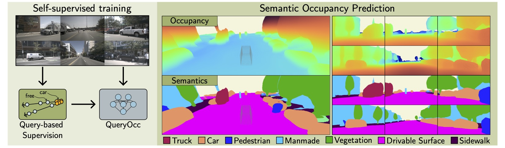
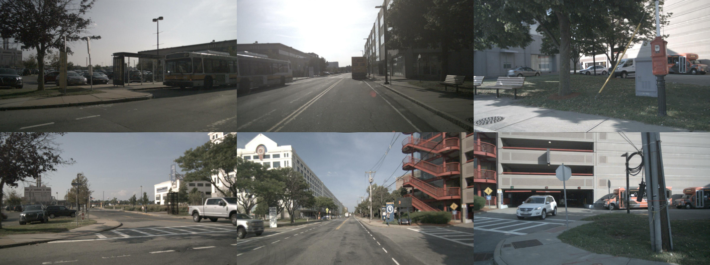
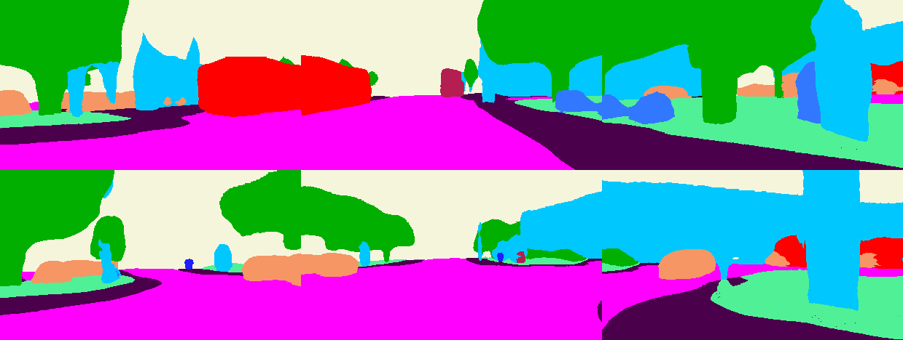
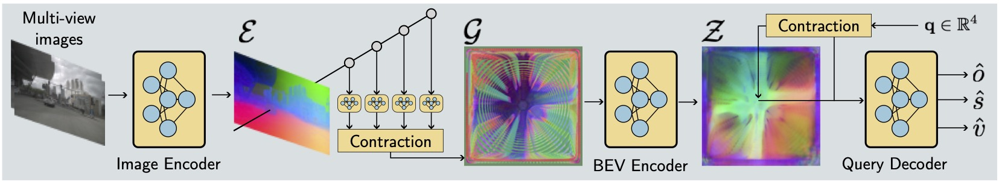
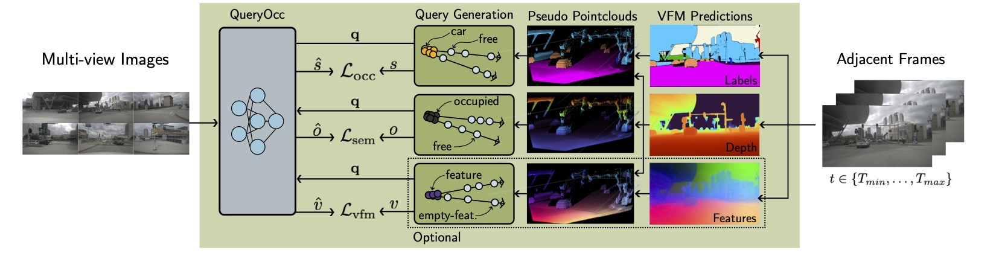
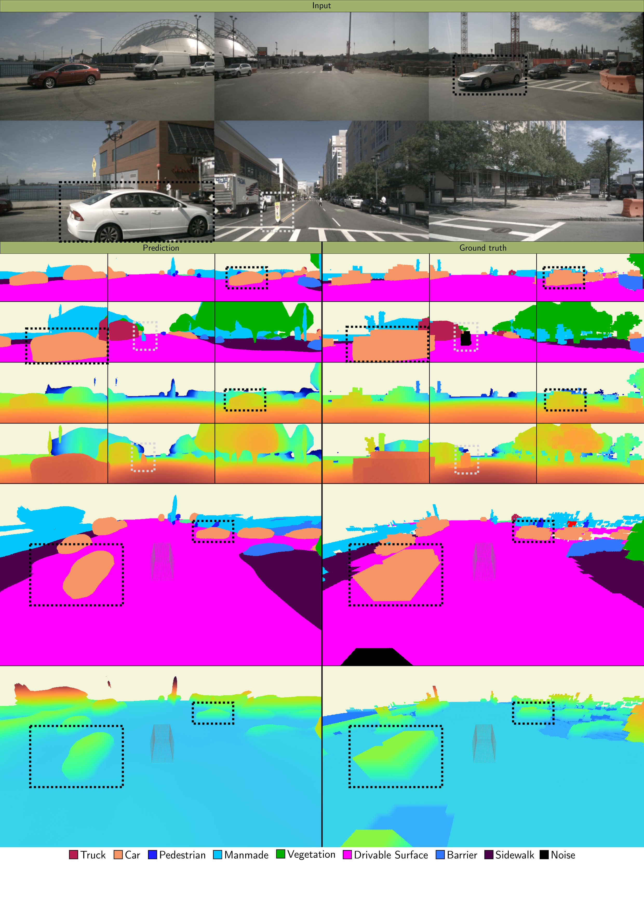
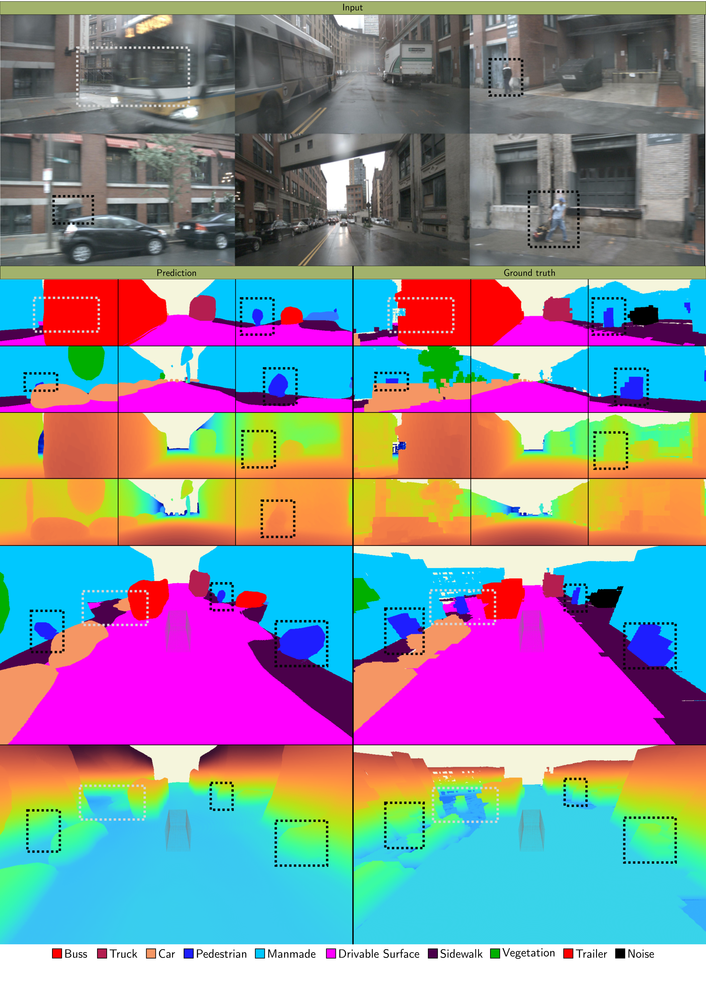
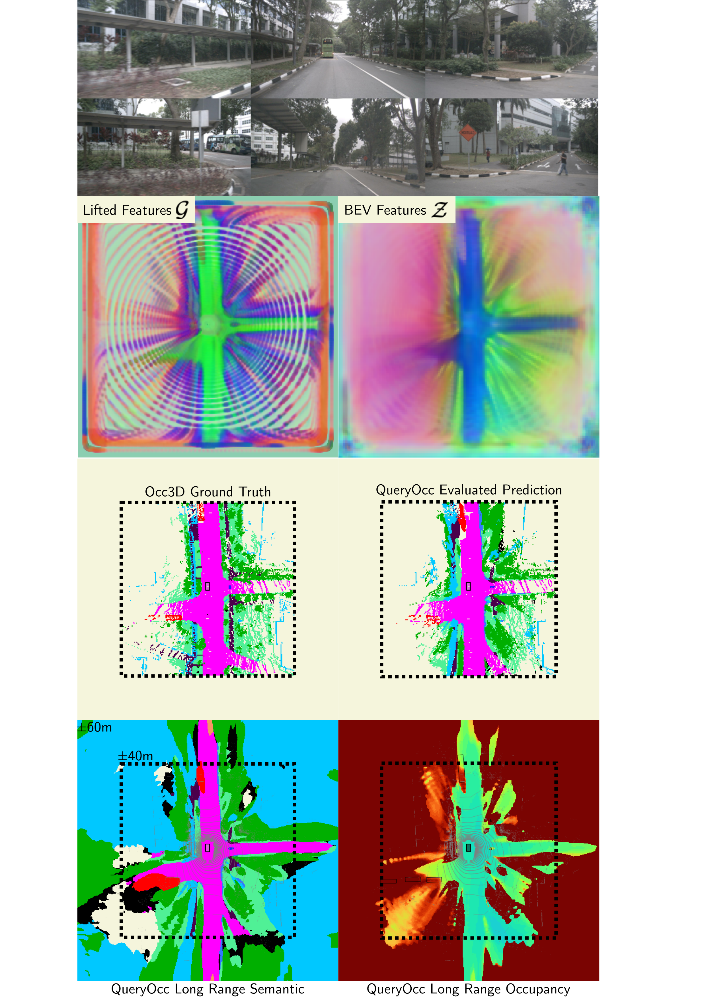
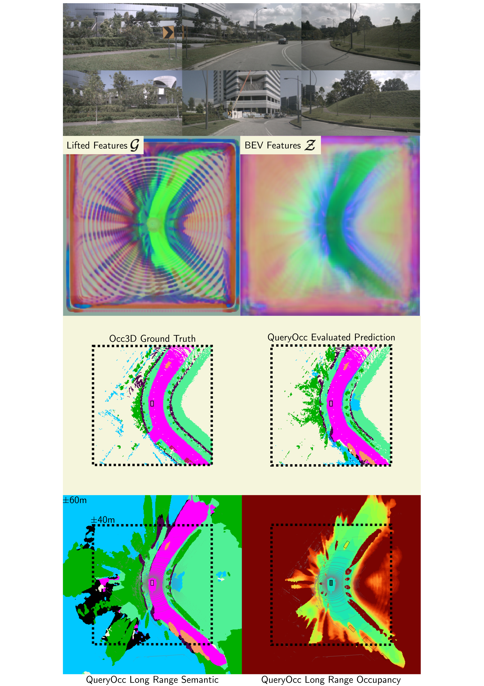

<div style="text-align: center; margin-bottom: 1em;">
<h1>TLDR: QueryOcc</h1>
<p style="font-weight: 500; width: 70%; margin: 0 auto; min-width: 400px;">
Query-based self-supervised framework that learns continuous 3D semantic occupancy directly through independent 4D spatio-temporal queries sampled across adjacent frames. 
The framework supports supervision from either pseudo-point clouds derived from vision foundation models or raw lidar data. 
To enable long-range supervision and reasoning under constant memory, we introduce a contractive scene representation that preserves near-field detail while smoothly compressing distant regions.
</p>
</div>

<figure class="figure__background" style="margin: 0;">
  
</figure>

<div style="display: grid; grid-template-columns: 1fr 1fr; gap: 0.5rem; margin: 1em 0 0.5rem;">
  <div class="video-hover" style="aspect-ratio: 1422 / 1904;">
    <video preload="auto" loop muted playsinline><source src="assets/videos/080a52cb8f59489b9cddc7b721808088.mp4" type="video/mp4"></video>
    <div class="video-hover__overlay"><span>▶</span></div>
  </div>
  <div class="video-hover" style="aspect-ratio: 1422 / 1904;">
    <video preload="auto" loop muted playsinline><source src="assets/videos/d1e57234fd6a463d963670938f9f556e.mp4" type="video/mp4"></video>
    <div class="video-hover__overlay"><span>▶</span></div>
  </div>
</div>
<div style="display: grid; grid-template-columns: 1fr 1fr; gap: 0.5rem; margin: 0 0 1em;">
  <div class="video-hover" style="aspect-ratio: 1422 / 1872;">
    <video preload="auto" loop muted playsinline><source src="assets/videos/16e50a63b809463099cb4c378fe0641e.mp4" type="video/mp4"></video>
    <div class="video-hover__overlay"><span>▶</span></div>
  </div>
  <div style="display: flex; flex-direction: column; gap: 0.5rem;">
    
    
    <div class="video-hover" style="aspect-ratio: 16 / 9;">
      <video preload="auto" loop muted playsinline><source src="assets/videos/orbit_16e50a63b809463099cb4c378fe0641e_0328.mp4" type="video/mp4"></video>
      <div class="video-hover__overlay"><span>▶</span></div>
    </div>
  </div>
</div>

<script>
document.querySelectorAll('.video-hover').forEach(function(el) {
  var video = el.querySelector('video');
  var overlay = el.querySelector('.video-hover__overlay');
  el.addEventListener('mouseenter', function() {
    video.play();
    overlay.style.opacity = '0';
  });
  el.addEventListener('mouseleave', function() {
    video.pause();
    overlay.style.opacity = '1';
  });
});
</script>

---

## Method

QueryOcc predicts whether any 3D point in the scene is occupied and its semantic class — directly from multi-view images, without ever building a fixed voxel grid. The model takes a 4D query and a set of calibrated images, and outputs an occupancy probability and a distribution over semantic classes for that exact point.

The pipeline has four stages: **(1)** a standard image encoder extracts per-view features, **(2)** a Lift–Contract–Splat module lifts them into a BEV representation, **(3)** ResBlocks and deformable attention process the BEV features, and **(4)** a lightweight decoder answers arbitrary 4D queries from the resulting feature map.

<figure class="figure__background" style="margin: 0;">
  
</figure>

---

## Self-Supervised Training

QueryOcc is trained without any manual 3D labels. Supervision comes entirely from observations at adjacent timesteps: the model must correctly predict occupancy and semantics at 4D queries derived from those frames.

<figure class="figure__background" style="margin: 0;">
  
</figure>

Point clouds are obtained from either images or lidar. In the **camera-only** setup (QueryOcc), metric depth from an off-the-shelf depth model lifts pixels into pseudo point clouds, paired with semantic pseudo-labels or dense vision foundation model (VFM) features. If lidar is available, observed point clouds can replace or augment the pseudo points — this extended setup is **QueryOcc+**.

From any point cloud, supervision is generated as a set of 4D queries sampled along sensor rays. **Negative (unoccupied) queries** are placed between the sensor origin and each surface point; **positive (occupied) queries** are placed just behind it. The model is trained with binary cross-entropy for occupancy, cross-entropy for semantics, and L1 for optional VFM feature distillation — all without ever discretizing the scene into a fixed voxel grid.

---

## Results

QueryOcc sets a new state of the art among self-supervised camera-based methods on **Occ3D-nuScenes**, surpassing all prior work across both semantic and geometric metrics — while running at **11.6 FPS**.

<div class="pub-table-wrap">
<table>
<thead>
<tr>
  <th rowspan="2">Method</th>
  <th colspan="3">RayIoU ↑</th>
  <th colspan="3">IoU ↑</th>
</tr>
<tr>
  <th>Sem.</th><th>Dyn.</th><th>Occ.</th>
  <th>Sem.</th><th>Dyn.</th><th>Occ.</th>
</tr>
</thead>
<tbody>
<tr>
  <td>SelfOcc<sup>†</sup></td>
  <td>10.9</td><td>7.2</td><td>29.2</td>
  <td>10.5</td><td>3.7</td><td>45.0</td>
</tr>
<tr>
  <td>OccNeRF</td>
  <td>—</td><td>—</td><td>—</td>
  <td>10.8</td><td>3.7</td><td>22.8</td>
</tr>
<tr>
  <td>DistillNeRF</td>
  <td>—</td><td>—</td><td>—</td>
  <td>10.1</td><td>5.2</td><td>29.1</td>
</tr>
<tr>
  <td>LangOcc<sup>†</sup></td>
  <td>11.6</td><td>9.0</td><td class="rank-2">38.7</td>
  <td>13.3</td><td>7.7</td><td class="rank-2">51.8</td>
</tr>
<tr>
  <td>GaussianOcc</td>
  <td>11.9</td><td>—</td><td>—</td>
  <td>11.3</td><td>7.0</td><td>—</td>
</tr>
<tr>
  <td>MinkOcc <small>w/lidar</small></td>
  <td>12.5</td><td>—</td><td>—</td>
  <td>13.2</td><td>3.4</td><td>—</td>
</tr>
<tr>
  <td>GaussTR<sup>†</sup> <small>FeatUp</small></td>
  <td>13.8</td><td>14.5</td><td>34.2</td>
  <td>13.3</td><td>9.0</td><td>45.2</td>
</tr>
<tr>
  <td>GaussTR<sup>†</sup> <small>T2D</small></td>
  <td class="rank-3">14.2</td><td class="rank-2">17.7</td><td>33.8</td>
  <td class="rank-3">13.9</td><td class="rank-1">13.4</td><td>44.5</td>
</tr>
<tr>
  <td>GaussianFlowOcc</td>
  <td class="rank-2">18.7</td><td>—</td><td>—</td>
  <td class="rank-2">17.1</td><td class="rank-3">10.1</td><td class="rank-3">46.9</td>
</tr>
<tr>
  <td>GaussianFlowOcc<sup>*</sup></td>
  <td>18.2</td><td class="rank-3">17.2</td><td class="rank-3">36.0</td>
  <td>16.1</td><td>9.9</td><td>40.2</td>
</tr>
<tr>
  <td><strong>QueryOcc</strong></td>
  <td class="rank-1"><strong>23.6</strong></td><td class="rank-1"><strong>21.7</strong></td><td class="rank-1"><strong>45.2</strong></td>
  <td class="rank-1"><strong>21.3</strong></td><td class="rank-2"><strong>13.2</strong></td><td class="rank-1"><strong>55.0</strong></td>
</tr>
<tr class="sep-above">
  <td><strong>QueryOcc+</strong></td>
  <td><strong>25.8</strong></td><td><strong>23.8</strong></td><td><strong>47.4</strong></td>
  <td><strong>23.5</strong></td><td><strong>15.7</strong></td><td><strong>56.9</strong></td>
</tr>
</tbody>
</table>
<p class="table-note">† RayIoU reproduced &nbsp;·&nbsp; * Both metrics reproduced &nbsp;·&nbsp; <span style="background:#fde68a;padding:0 0.3em;">1st</span> <span style="background:#bfdbfe;padding:0 0.3em;">2nd</span> <span style="background:#fed7aa;padding:0 0.3em;">3rd</span> among comparable methods.</p>
</div>

<div class="pub-table-wrap">
<table>
<thead>
<tr>
  <th>Model</th>
  <th>Mean</th>
  <th class="th-rotate"><span>Barrier</span></th>
  <th class="th-rotate"><span>Bicycle</span></th>
  <th class="th-rotate"><span>Bus</span></th>
  <th class="th-rotate"><span>Car</span></th>
  <th class="th-rotate"><span>Cons. veh.</span></th>
  <th class="th-rotate"><span>Drive. surf.</span></th>
  <th class="th-rotate"><span>Manmade</span></th>
  <th class="th-rotate"><span>Motorcycle</span></th>
  <th class="th-rotate"><span>Pedestrian</span></th>
  <th class="th-rotate"><span>Sidewalk</span></th>
  <th class="th-rotate"><span>Terrain</span></th>
  <th class="th-rotate"><span>Traffic cone</span></th>
  <th class="th-rotate"><span>Trailer</span></th>
  <th class="th-rotate"><span>Truck</span></th>
  <th class="th-rotate"><span>Vegetation</span></th>
</tr>
</thead>
<tbody>
<tr>
  <td>SelfOcc</td><td>10.5</td>
  <td>0.2</td><td>0.7</td><td>5.5</td><td>12.5</td><td>0.0</td><td class="rank-3">55.5</td><td>14.2</td><td>0.8</td><td>2.1</td><td class="rank-3">26.3</td><td class="rank-3">26.5</td><td>0.0</td><td>0.0</td><td>8.3</td><td>5.6</td>
</tr>
<tr>
  <td>OccNeRF</td><td>10.8</td>
  <td>0.8</td><td>0.8</td><td>5.1</td><td>12.5</td><td>3.5</td><td>52.6</td><td>18.5</td><td>0.2</td><td>3.1</td><td>20.8</td><td>24.8</td><td>1.8</td><td>0.5</td><td>3.9</td><td>13.2</td>
</tr>
<tr>
  <td>DistillNeRF</td><td>10.1</td>
  <td>1.4</td><td>2.1</td><td>10.2</td><td>10.1</td><td>2.6</td><td>43.0</td><td>14.1</td><td>2.0</td><td>5.5</td><td>16.9</td><td>15.0</td><td>4.6</td><td>1.4</td><td>7.9</td><td>15.1</td>
</tr>
<tr>
  <td>LangOcc</td><td>13.3</td>
  <td>3.1</td><td class="rank-2">9.0</td><td>6.3</td><td>14.2</td><td>0.4</td><td>43.7</td><td class="rank-3">19.6</td><td class="rank-3">10.8</td><td>6.2</td><td>9.5</td><td>26.4</td><td>9.0</td><td class="rank-2">3.8</td><td>10.7</td><td class="rank-1">26.4</td>
</tr>
<tr>
  <td>GaussianOcc</td><td>11.3</td>
  <td>1.8</td><td>5.8</td><td>14.6</td><td>13.6</td><td>1.3</td><td>44.6</td><td>8.6</td><td>2.8</td><td class="rank-3">8.0</td><td>20.1</td><td>17.6</td><td class="rank-3">9.8</td><td>0.6</td><td>9.6</td><td>10.3</td>
</tr>
<tr>
  <td>GaussTR <small>FeatUp</small></td><td>13.3</td>
  <td>2.1</td><td>5.2</td><td>14.1</td><td class="rank-3">20.4</td><td class="rank-2">5.7</td><td>39.4</td><td class="rank-2">21.2</td><td>7.1</td><td>5.1</td><td>15.7</td><td>22.9</td><td>3.9</td><td>0.9</td><td class="rank-3">13.4</td><td class="rank-3">21.9</td>
</tr>
<tr>
  <td>GaussTR <small>T2D</small></td><td class="rank-3">13.9</td>
  <td class="rank-3">6.5</td><td class="rank-3">8.5</td><td class="rank-2">21.8</td><td class="rank-1">24.3</td><td class="rank-1">6.3</td><td>37.0</td><td class="rank-2">21.2</td><td class="rank-1">15.5</td><td>7.9</td><td>17.2</td><td>7.2</td><td>1.9</td><td class="rank-1">6.1</td><td class="rank-2">17.2</td><td>10.0</td>
</tr>
<tr>
  <td>GaussianFlowOcc</td><td class="rank-2">17.1</td>
  <td class="rank-2">7.2</td><td class="rank-1">9.3</td><td class="rank-3">17.6</td><td>17.9</td><td>4.5</td><td class="rank-2">63.9</td><td>14.6</td><td>9.3</td><td class="rank-2">8.5</td><td class="rank-2">31.1</td><td class="rank-2">35.1</td><td class="rank-2">10.7</td><td>2.0</td><td>11.8</td><td>12.6</td>
</tr>
<tr>
  <td><strong>QueryOcc</strong></td><td class="rank-1"><strong>21.3</strong></td>
  <td class="rank-1"><strong>7.3</strong></td><td>6.8</td><td class="rank-1"><strong>26.5</strong></td><td class="rank-2"><strong>20.9</strong></td><td class="rank-3">4.8</td><td class="rank-1"><strong>69.2</strong></td><td class="rank-1"><strong>25.2</strong></td><td class="rank-2"><strong>10.9</strong></td><td class="rank-1"><strong>15.0</strong></td><td class="rank-1"><strong>34.5</strong></td><td class="rank-1"><strong>38.4</strong></td><td class="rank-1"><strong>13.2</strong></td><td class="rank-3">3.7</td><td class="rank-1"><strong>17.3</strong></td><td class="rank-2"><strong>25.7</strong></td>
</tr>
<tr class="sep-above">
  <td><strong>QueryOcc+</strong></td><td><strong>23.5</strong></td>
  <td><strong>9.0</strong></td><td><strong>10.0</strong></td><td><strong>30.4</strong></td><td><strong>25.5</strong></td><td>4.6</td><td><strong>69.6</strong></td><td><strong>28.0</strong></td><td><strong>16.5</strong></td><td><strong>17.0</strong></td><td><strong>37.2</strong></td><td><strong>42.4</strong></td><td>11.8</td><td>3.4</td><td><strong>18.5</strong></td><td><strong>28.8</strong></td>
</tr>
</tbody>
</table>
<p class="table-note">Per-class IoU ↑ on Occ3D-nuScenes. <span style="background:#fde68a;padding:0 0.3em;">1st</span> <span style="background:#bfdbfe;padding:0 0.3em;">2nd</span> <span style="background:#fed7aa;padding:0 0.3em;">3rd</span> among comparable methods.</p>
</div>

---

## Qualitative Examples

QueryOcc produces sharp geometry, maintains fine-grained detail, and infers plausible structures behind occlusions.

<div style="display: grid; grid-template-columns: 1fr 1fr 1fr; gap: 0.75rem; margin: 1em 0;">
  <figure style="margin: 0;">
    
    <figcaption><strong>Scene A</strong> — Sharp vehicle geometry and fine structures like road signs recovered.</figcaption>
  </figure>
  <figure style="margin: 0;">
    
    <figcaption><strong>Scene B</strong> — Motorcyclist detected; thin poles missed. Background regions predicted well.</figcaption>
  </figure>
  <figure style="margin: 0;">
    
    <figcaption><strong>Scene C</strong> — Pedestrians reconstructed including partially occluded instances. Plausible surface inferred behind occlusions.</figcaption>
  </figure>
</div>

**Long-range predictions** — Extending visualization from ±40 m to ±60 m shows that the contracted BEV preserves useful geometric signal well beyond the evaluation boundary.

<div style="display: grid; grid-template-columns: 1fr 1fr; gap: 0.75rem; margin: 1em 0;">
  <figure style="margin: 0;">
    
    <figcaption><strong>Scene D</strong> — Road layout and free-space remain consistent far outside the high-resolution region.</figcaption>
  </figure>
  <figure style="margin: 0;">
    
    <figcaption><strong>Scene E</strong> — Bending road curvature recovered from contracted features at 60 m range.</figcaption>
  </figure>
</div>

---

# BibTeX
```bibtex
@article{lilja2026queryocc,
  title        = {QueryOcc: Query-based Self-Supervision for 3D Semantic Occupancy},
  author       = {Adam Lilja and Ji Lan and Junsheng Fu and Lars Hammarstrand},
  journal      = {Proceedings of the IEEE/CVF Conference on Computer Vision and Pattern Recognition},
  year         = {2026}
}
```
