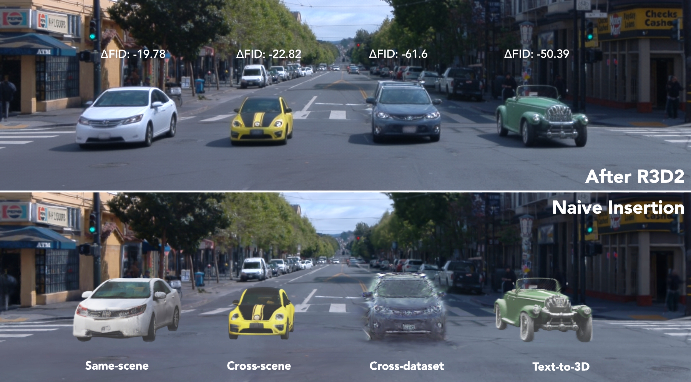
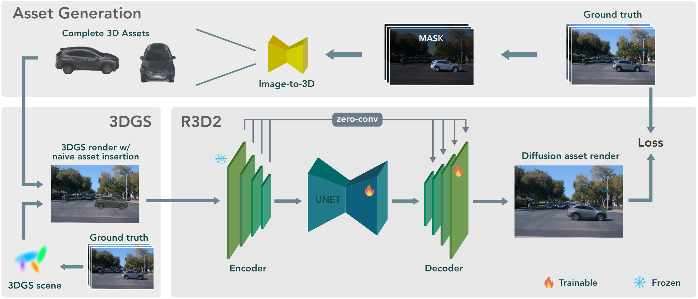

<figure class="figure__background">
  
  <figcaption><b>Fig 1.:</b> R3D2 enables realistic insertion of 3D assets from different origins into existing scene reconstructions. From left to right, assets are sourced from: the same scene, a different scene, a different dataset, and a text-to-3D generative model. Bottom: naive insertion, top: insertion + R3D2.</figcaption>
</figure>

---

# Abstract

{% include interactive_image.html
   columns=3
   images="
     _publications/r3d2/assets/images/r3d2_FRONT_00000027.jpg,_publications/r3d2/assets/images/naive_FRONT_00000027.jpg,_publications/r3d2/assets/images/gt_FRONT_00000027.jpg,Cross scene object insertion,Cross scene object insertion|
     _publications/r3d2/assets/images/r3d2_FRONT_00000027.jpg,_publications/r3d2/assets/images/naive_FRONT_00000027.jpg,_publications/r3d2/assets/images/gt_FRONT_00000027.jpg,Cross dataset object insertion,Cross dataset object insertion|
     _publications/r3d2/assets/images/r3d2_FRONT_00000027.jpg,_publications/r3d2/assets/images/naive_FRONT_00000027.jpg,_publications/r3d2/assets/images/gt_FRONT_00000027.jpg,Text-to-3D object insertion,Text-to-3D object insertion
   "
%}

# Method

<figure class="figure__background">
  
  <figcaption><b>Fig 2.:</b> Overview of the R3D2 training pipeline. Generating assets from the original data, which are then inserted into 3DGS-reconstructed environments in place of the corresponding real objects. Rendering the modified scene alongside the original yields training pairs, enabling R3D2 to learn to add realistic shadows and lighting effects</figcaption>
</figure>

# Object Rotation



# Foreign Object Rendering



# Text-to-3D Object Insertion

# Performance
