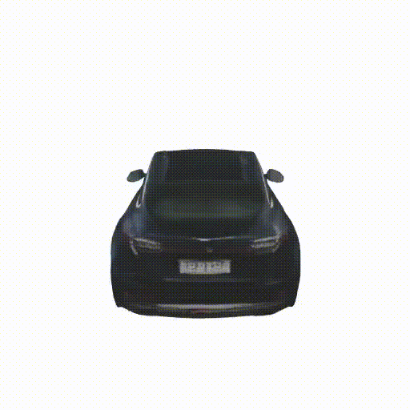

<figure class="figure__background">
  
  <figcaption><b>Fig 1.:</b> R3D2 enables realistic insertion of 3D assets from different origins into existing scene reconstructions. From left to right, assets are sourced from: the same scene, a different scene, a different dataset, and a text-to-3D generative model. Bottom: naive insertion, top: insertion + R3D2.</figcaption>
</figure>

---

# Abstract
Validating autonomous driving (AD) systems requires diverse and safety-critical testing, making photorealistic virtual environments essential. Traditional simulation platforms, while controllable, are resource-intensive to scale and often suffer from a domain gap with real-world data. In contrast, neural reconstruction methods like 3D Gaussian Splatting (3DGS) offer a scalable solution for creating photorealistic digital twins of real-world driving scenes. However, they struggle with dynamic object manipulation and reusability as their per-scene optimization-based methodology tends to result in incomplete object models with integrated illumination effects. This paper introduces R3D2, a lightweight, one-step diffusion model designed to overcome these limitations and enable realistic insertion of complete 3D assets into existing scenes by generating plausible rendering effects—such as shadows and consistent lighting—in real time. This is achieved by training R3D2 on a novel dataset: 3DGS object assets are generated from in-the-wild AD data using an image-conditioned 3D generative model, and then synthetically placed into neural rendering-based virtual environments, allowing R3D2 to learn realistic integration. Quantitative and qualitative evaluations demonstrate that R3D2 significantly enhances the realism of inserted assets, enabling use-cases like text-to-3D asset insertion and cross-scene/dataset object transfer, allowing for true scalability in AD validation.

# Method

<figure class="figure__background">
  
  <figcaption><b>Fig 2.:</b> Overview of the R3D2 training pipeline. Generating assets from the original data, which are then inserted into 3DGS-reconstructed environments in place of the corresponding real objects. Rendering the modified scene alongside the original yields training pairs, enabling R3D2 to learn to add realistic shadows and lighting effects</figcaption>
</figure>

### Asset Generation
We use an image-conditioned 3D generative model, [Amodal3R](https://sm0kywu.github.io/Amodal3R/), to generate 3D assets from real-world images. These assets are similar to the original object in shape and color, but lack realistic rendering effects such as shadows and lighting when placed into our 3DGS scenes. 

<figure class="figure__background">
  
  <figcaption><b>Fig 3.:</b> Example of an input image used to generate a 3D asset with Amodal3R.</figcaption>
</figure>
<figure class="figure__background">
  
  <figcaption><b>Fig 4.:</b> Example of a generated 3D asset from the input image.</figcaption>
</figure>

### Scene Reconstruction
We use [SplatAD](https://research.zenseact.com/publications/splatad/), to reconstruct the scene from the original data. We then take our generated 3D assets and insert them into the reconstructed scene, replacing the original objects. This allows us to create a modified scene that contains the new assets but lacks realistic rendering effects.

# Object Rotation

We show how our method is able to help improve rendering of manipulated actors. We rotate all actors 20 degrees and run the rendered image with R3D2.

<!-- 
 -->

<i class="fas fa-mouse-pointer"></i> Hover the image to <b>rotate objects</b>, and click to see <b>before R3D2</b>



# Cross-Dataset Object Insertion
In these we replaced the assets of 3DGS scenes from Waymo with 3DGS assets from PandaSet sequences. 

<!-- 
 -->

<i class="fas fa-mouse-pointer"></i> Hover the image to <b>replace actors</b>, and click to see <b>before R3D2</b>



# Text-to-3D Object Insertion

<i class="fas fa-mouse-pointer"></i> Hover the image to <b>replace actors</b>, and click to see <b>before R3D2</b>



# Performance
