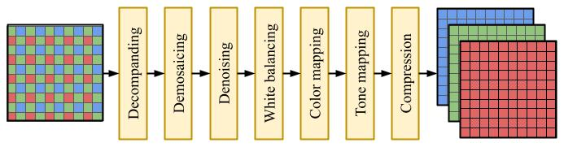
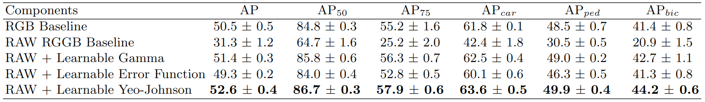
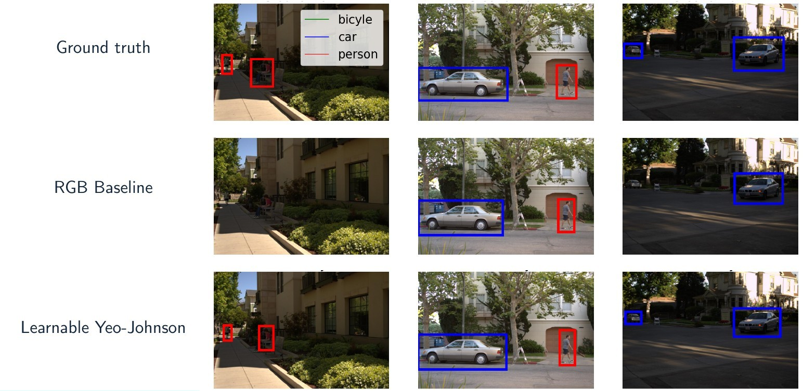

# TL;DR
We propose doing **object detection from RAW images**, rather than from RGB images. We propose a learnable non-linearity, inspired by a transformation that seeks to improve the normality of the data, that is applied to the RAW image before it is fed to the object detector. We show that **this quantitatively improves performance**, compared to the traditional RGB pipeline, on the PASCALRAW dataset and qualitatively we observe that **the RAW object detector tends to perform better in poor lighting conditions**.

# Basic idea
Generally, when working with computer vision, and deep neural networks, in particular, we start from the familiar RGB image. This is what people tend to consider to be the raw camera data, however, this is somewhat incorrect. To obtain the RGB image, the RAW camera data has undergone **several handcrafted image signal processing (ISP)** operations, all of which have been optimized to produce visually pleasing images. What we investigate in this work **is whether this intermediate representation, the visually pleasing RGB image, is the best representation for the task at hand**. Intuitively, the idea that a handcrafted representation is sub-optimal and that we can **obtain superior performance by letting the optimization of the representation be guided by the end** task seems reasonable. In summary, we want to replace the traditional pipeline, with a learnable pipeline defined by a learnable operation \\(F(\mathbf{x})\\).
<figure>
  
  <figcaption>Fig 1. Traditional and proposed object detection pipeline. We replace the handcrafted ISP pipeline (left) with a learnable module (right).</figcaption>
</figure>

# Background on ISPs
As I mentioned above, the very familiar RGB image **is actually not the RAW camera data**, but rather a result of processing the actual RAW camera data into a representation that is visually pleasing for us as humans. The RAW camera data generally look more like what you can see on the left in Figure 2, an interleaved pattern of red, green, and blue filters. This is what is referred to as [Bayer filter pattern](https://en.wikipedia.org/wiki/Bayer_filter), and while there are other configurations of color filters, the Bayer pattern is considered the most common.

In the ISP pipeline, the RAW data is processed sequentially by handcrafted operations. Even though an ISP can comprise any combination of operations, a common set of operations include demosaicing, denoising, white balancing, and tone mapping. An overview of a common ISP pipeline is shown in Figure 2.
<figure>
  
  <figcaption>Fig 2. Overview of a traditional ISP pipeline. Starting with the RAW camera data on the left and the RGB image on the right.</figcaption>
</figure>

# Learnable operations

We study several different learnable operations \\(F(\mathbf{x})\\) that can be applied to the RAW image before it is fed to the object detector, all of which are outlined in slight detail below.

**Learnable gamma correction.**
Previous works [1, 2] have shown that [demosaicing](https://en.wikipedia.org/wiki/Demosaicing) and [tone mapping](https://en.wikipedia.org/wiki/Tone_mapping) are the most important operations in a traditional ISP pipeline. We, therefore, start by investigating a learnable gamma correction (which is one of the most common tone mapping techniques) operations, defined as

$$
F_{\text{d}}(\mathbf{x}) = \mathbf{x_d}^{\gamma},
$$

where \\(\mathbf{x_d}\\) is the [demosaiced](https://en.wikipedia.org/wiki/Demosaicing) RAW image and \\(\gamma\\) is the learnable parameter optimized during training.

**Learnable error function.**
The Learnable Gamma Correction still comprises two sequential operations (demosaicing and gamma correction). One can think of even more simple operations, such as a single non-linearity, that might be able to capture the same information. To this end, we adopt the [Gauss error function](https://en.wikipedia.org/wiki/Error_function) and define learnable shift and scaling parameters to obtain a learnable error function as

$$
F_{\text{erf}}(\mathbf{x}) = \text{erf} \left( \frac{\mathbf{x} - \mu}{\sqrt{2}\sigma} \right),
$$

where \\(\mu\\) and \\(\sigma\\) are learnable parameters optimized during training.

**Learnable Yeo-Johnson transformation.**
Lastly, by observing that the RAW data was far from normally distributed and knowing the fact that this is a characteristic that tends to improve the performance of deep neural networks, we sought to find a transformation that would make the RAW data more normally distributed. To this end, we adopt the [Yeo-Johnson transformation](https://en.wikipedia.org/wiki/Power_transform#Yeo%E2%80%93Johnson_transformation) [3] and define a  learnable version of it as

$$
F_{\text{YJ}}(\mathbf{x}) = \frac{(\mathbf{x} + 1)^\lambda - 1}{\lambda},
$$

where \\(\lambda\\) is a learnable parameter optimized during training.

# Results

To evaluate the effect our proposed learnable operations have on downstream computer vision tasks, we employ an object detection setting. Here, we make use of the [PASCALRAW dataset](https://searchworks.stanford.edu/view/hq050zr7488), which comprises RAW and RGB images, as well as 2D bounding box annotations for *cars*, *pedestrians*, and *bicycles*.

We adopt a [Faster R-CNN](https://arxiv.org/abs/1506.01497) [4] object detector, coupled with a [Feature Pyramid Network](https://arxiv.org/abs/1612.03144) [5], and use a [ResNet-50](https://arxiv.org/abs/1512.03385) [6] backbone. We train each of our proposed learnable operations end-to-end with their respective network, and evaluate their performance according to the mean average precision (AP) metric, as defined in the COCO evaluation protocol [7].

**Qualitative results.** We evaluated our three pipelines separately, and compared them to two baselines:
1. RGB baseline. This is the traditional object detection pipeline, where we feed the RGB image directly into the object detector.
2. Naïve baseline. Here, we feed the RAW image directly into the object detector, without any learnable operations. In other words letting \\(F(\mathbf{x}) = \mathbf{x}\\).

In Table 1 we present the quantitative results for each of our learnable operations and the baselines. Here, the results are presented as mean and standard deviation across three seperate runs. As you can see, our RAW + Learnable Yeo-Johnson detector outperforms both the RGB and naïve baselines, as well as the other learnable operations, with some margin.
<figure>
  <figcaption>Tab 1. Quantitative results on the PASCALRAW dataset.</figcaption>
  
</figure>

**Quantitative results.** In Figure 4 below you see three examples from the PASCALRAW dataset. We show the ground truth bounding boxes in the top row, RGB baseline detections in the center, and RAW + Yeo-Johnson detections in the bottom row. We observe that the RAW + Yeo-Johnson detector tends to perform better in low-light conditions, compared to the RGB baseline detector, but also that they have similar performance in well-lit conditions.

<figure>
  
  <figcaption>Fig 4. Qualitative results on the PASCALRAW dataset.</figcaption>
</figure>

# Concluding remarks
Motivated by the observation that camera ISP pipelines are typically optimized toward producing visually pleasing images for the human eye, we have in this work experimented with object detection on RAW images. While naïvely feeding RAW images directly into the object detection backbone led to poor performance, we proposed three simple, learnable operations that all led to good performance. Two of these operators, the *Learnable Gamma* and *Learnable Yeo-Johnson*, led to superior performance compared to the RGB baseline detector. Based on qualitative comparison, the RAW detector performs better in low-light conditions compared to the RGB detector.

---

**References**

[1] Buckler, M., Jayasuriya, S., Sampson, A.: [Reconfiguring the imaging pipeline for computer vision](https://arxiv.org/abs/1705.04352). Proceedings of the IEEE International Conference on Computer Vision. pp. 975–984 (2017)

[2] Olli Blom, M., Johansen, T.: ["End-to-end object detection on raw camera data"](https://odr.chalmers.se/handle/20.500.12380/302196). (2021)

[3] Yeo, I.K., Johnson, R.A.: ["A new family of power transformations to improve normality or symmetry"](https://www.jstor.org/stable/2673623). Biometrika 87(4), 954–959 (2000)

[4] Ren, S., He, K., Girshick, R., Sun, J.: [Faster r-cnn: Towards real-time object detection with region proposal networks](https://arxiv.org/abs/1506.01497). Advances in neural information processing systems 28 (2015)

[5] Lin, T.Y., Dollár, P., Girshick, R., He, K., Hariharan, B., Belongie, S.: [Feature pyramid networks for object detection](https://arxiv.org/abs/1612.03144). Proceedings of the IEEE conference on computer vision and pattern recognition. pp. 2117–2125 (2017)

[6] He, K., Zhang, X., Ren, S., Sun, J.: [Deep residual learning for image recognition](https://arxiv.org/abs/1512.03385). Proceedings of the IEEE conference on computer vision and pattern recognition.
pp. 770–778 (2016)

[7] Lin, T.Y., Maire, M., Belongie, S., Hays, J., Perona, P., Ramanan, D., Dollár, P., Zitnick, C.L.: [Microsoft coco: Common objects in context](https://arxiv.org/abs/1405.0312). European conference on computer vision. pp. 740–755. Springer (2014)