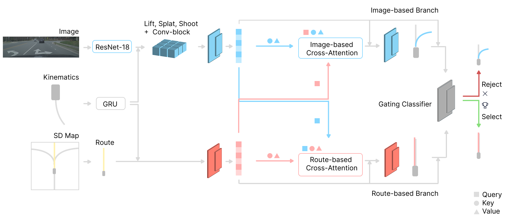
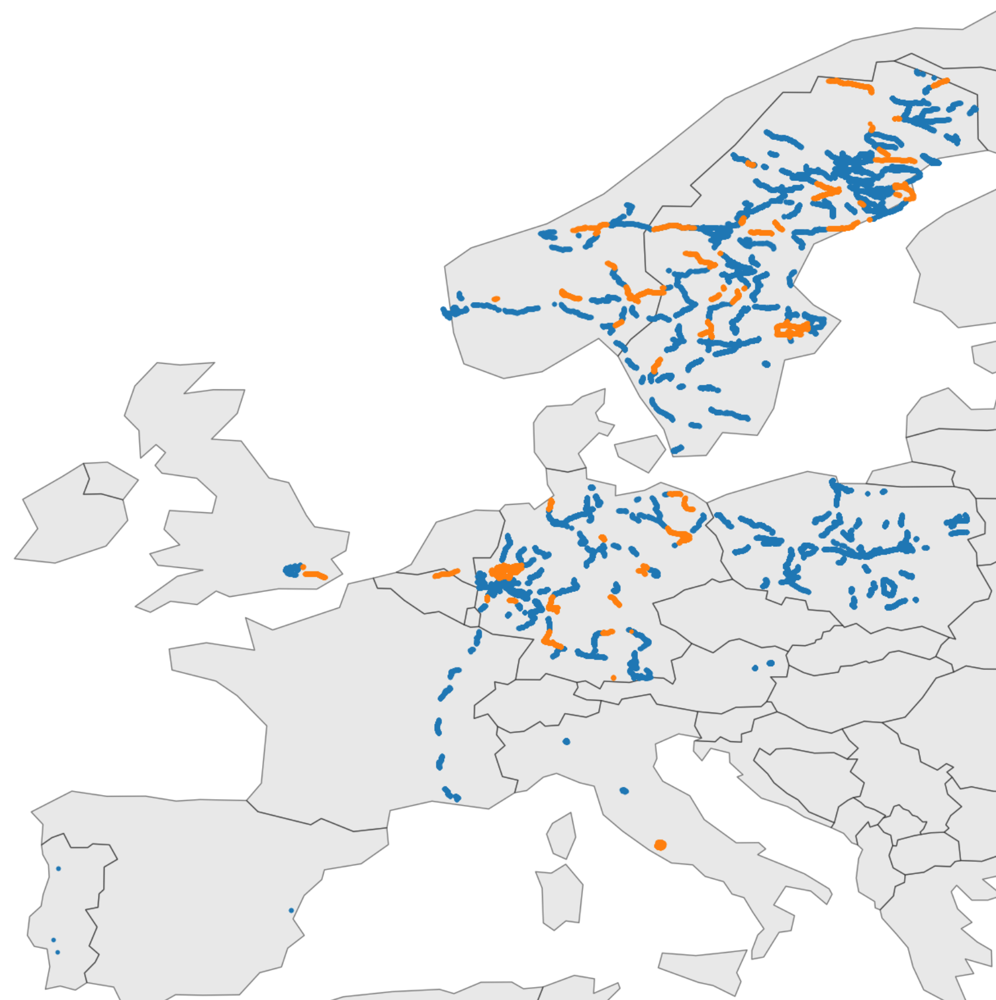
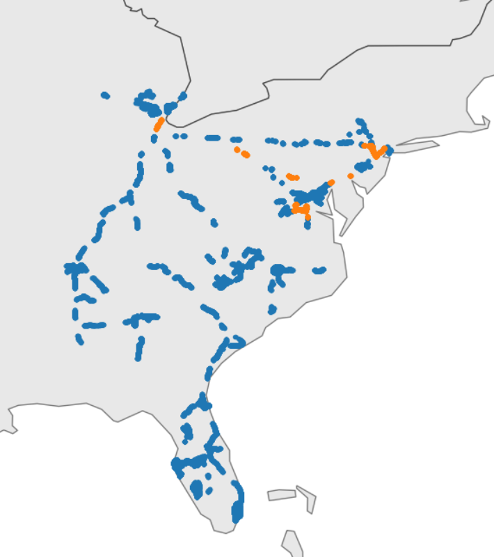
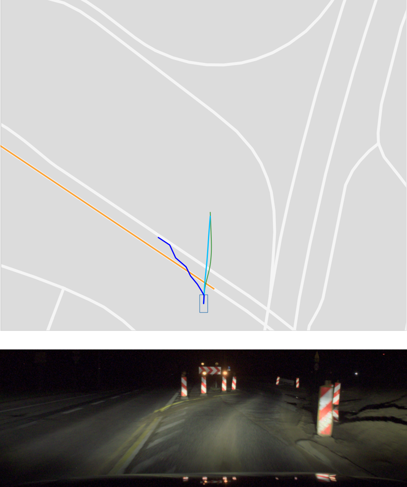
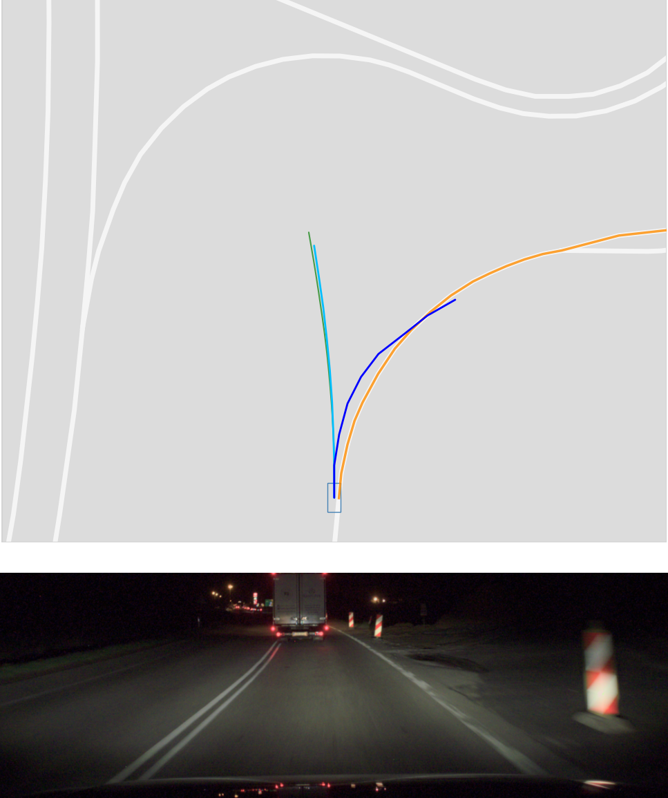
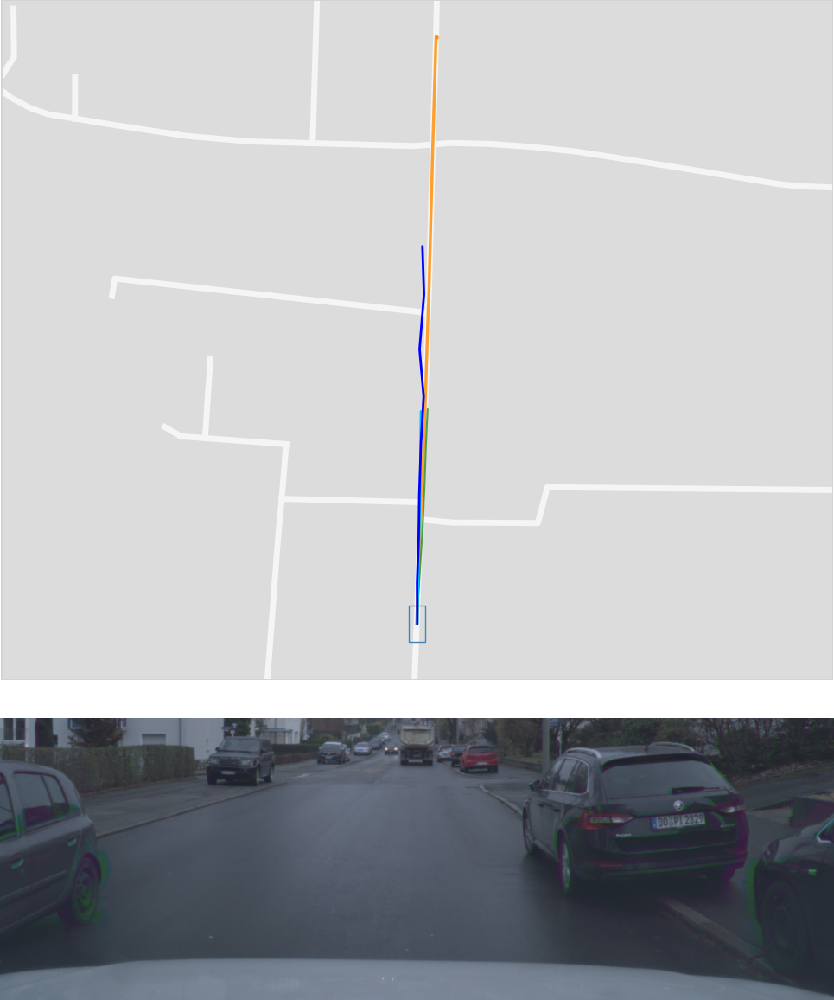
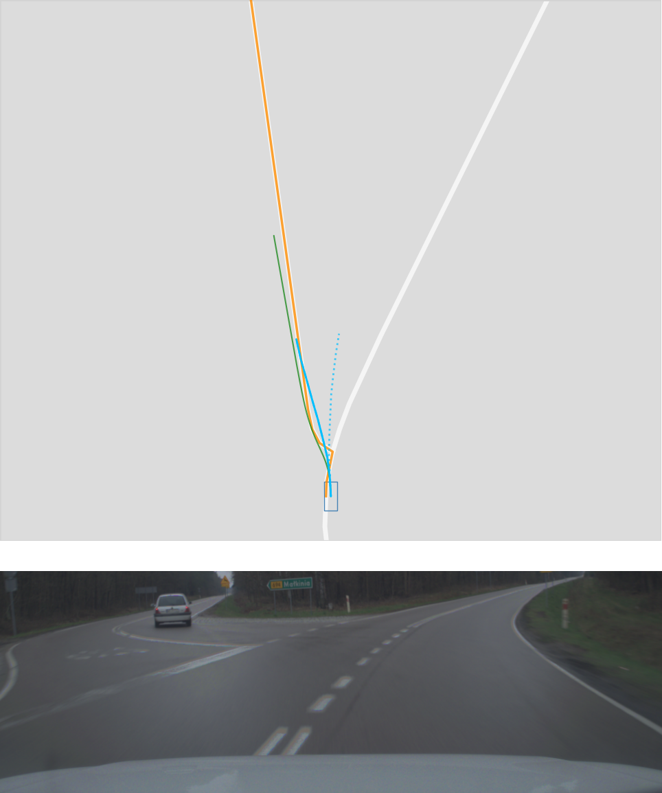
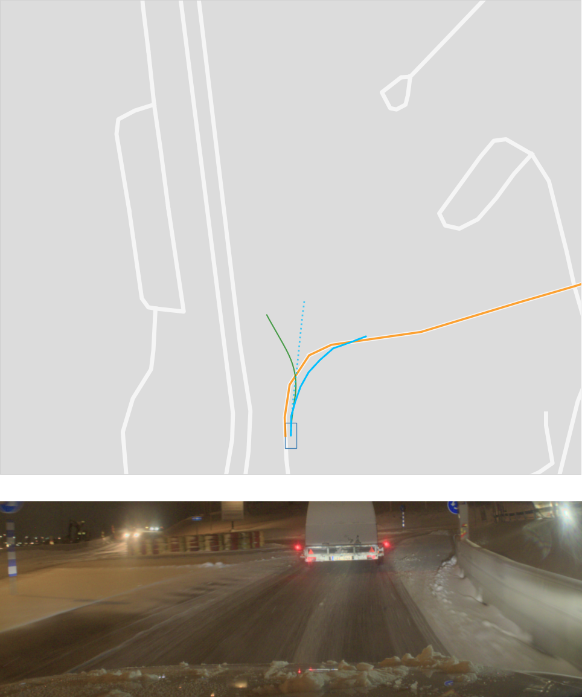

# TLDR

We introduce SD-RouteFusion, an end-to-end ego-trajectory prediction method that combines a front-facing camera, ego-vehicle kinematics, and a navigation route derived from scalable Standard Definition maps. By using SD-map route intent as a long-horizon prior and selecting between route-led and image-led trajectory hypotheses, SD-RouteFusion improves prediction accuracy while remaining robust when route information is noisy or wrong.

---

# Abstract

Ego-trajectory prediction is a core component for autonomous driving systems, helping estimate how the ego vehicle is likely to move in the near future. Many existing methods rely on High Definition maps (HD maps), which provide precise lane-level geometry but are expensive to build, maintain, and scale globally.

In contrast, production vehicles routinely have access to lightweight navigation routes from Standard Definition maps. These routes are globally available and practical for deployment, but they can be noisy due to localization drift, stale map data, roadworks, or map connectivity errors.

We propose SD-RouteFusion, a deployable end-to-end ego-trajectory prediction framework that conditions on a front-facing camera image, ego-vehicle kinematics, and an SD-map-derived navigation route. The model generates two complementary trajectory hypotheses: one led by visual evidence and one led by route intent. A gating classifier then selects the more reliable prediction at inference time.

On a large-scale real-world dataset with 480k driving scenarios collected across 10 European countries and the U.S., SD-map route conditioning substantially improves long-horizon prediction. Adding SD-route information reduces ADE by 10.5% over an image-and-kinematics baseline, while the full SD-RouteFusion architecture achieves a 16.9% ADE reduction over the same baseline for an 8-second prediction horizon.

---

# Method

<figure class="figure__background" style="max-width: 900px; margin: 0 auto;">
  
  <figcaption><b>Fig 1.:</b> Overview of SD-RouteFusion. Inputs are the navigation route retrieved from an SD map, the front-facing camera image, and ego-vehicle kinematics. Two branches predict a trajectory — one image-based, one route-based — with mirrored cross-attention exchanging information between modalities, and a gating classifier selects the final prediction. Image features are lifted to a bird's-eye view via Lift-Splat-Shoot.</figcaption>
</figure>

SD-RouteFusion is designed around a practical deployment setting: a forward-facing camera, ego-vehicle state, and a navigation route. Instead of requiring HD-map lane geometry, we use a route prior generated from SD maps.

The route prior is constructed by projecting the ego vehicle’s start and end positions onto nearby OpenStreetMap road links and searching over topology-consistent candidate routes. The selected route is the one that best matches the ground-truth future displacement, and is then re-centered relative to the ego vehicle. In deployment, the same type of signal can be obtained directly from the vehicle’s onboard navigation system.

The model has three main inputs:

- a front-facing camera image,
- recent ego-vehicle kinematics,
- an SD-map navigation route.

The camera image is encoded using a ResNet-18 backbone and lifted into a bird’s-eye-view representation. The kinematics are encoded using a GRU, while the route is encoded with a lightweight MLP. These embeddings are then fused through mirrored cross-attention blocks.

This produces two trajectory hypotheses:

- an image-led prediction, which relies more strongly on local visual cues and can act as a fallback when the route is unreliable;
- a route-led prediction, which follows long-horizon route intent and is useful when visual information is ambiguous or occluded.

A gating classifier compares the two hypotheses and selects the final trajectory prediction. This hard selection avoids simply blending conflicting signals, which is especially important when the route prior is mislocalized, outdated, or inconsistent with the observed scene.

---

# Dataset

We evaluate on an internal extension of the Zenseact Open Dataset (ZOD) containing 480k driving scenarios, collected primarily across ten countries in Northern and Central Europe and along the U.S. East Coast. Each scenario provides a forward-facing camera image, ego-vehicle state, and an 8-second ground-truth future trajectory.

<div style="display: flex; justify-content: center; align-items: flex-end; gap: 2em; flex-wrap: wrap;">
  <div style="text-align: center;">
    
    <figcaption>(a) Europe</figcaption>
  </div>
  <div style="text-align: center;">
    
    <figcaption>(b) U.S. East Coast</figcaption>
  </div>
</div>
<figcaption style="text-align: center;"><b>Fig 2.:</b> Geographic coverage of the dataset, split into <span style="color:#1f77b4"><b>train</b></span> and <span style="color:#ff7f0e"><b>test</b></span> scenarios.</figcaption>

---

# Results

We evaluate SD-RouteFusion on the full test set, on turning cases (ground-truth lateral displacement above 75 m), and at a shorter 5-second horizon. The table below reports Average Displacement Error (ADE), Final Displacement Error (FDE), and Miss Rate (MR, 4 m threshold); lower is better throughout.

| Model | ADE (8s) | FDE (8s) | MR (8s) | ADE (turn) | FDE (turn) | ADE (5s) | FDE (5s) |
|:---|:---:|:---:|:---:|:---:|:---:|:---:|:---:|
| Route-CVM | 5.10 | 12.02 | 0.80 | 7.48 | 18.04 | 2.43 | 5.20 |
| I + K | 2.19 | 5.58 | 0.67 | 2.47 | 6.43 | 0.93 | 2.10 |
| I + K + R | 1.96 | 4.51 | 0.55 | 2.04 | 4.63 | 0.99 | 1.96 |
| **SD-RouteFusion** | **1.82** | **4.32** | **0.55** | **1.92** | **4.50** | **0.88** | **1.85** |
{: style="display: table; width: auto; margin: 1.5em auto;"}

<p style="text-align: center; font-style: italic; margin-top: -0.5em;">I = image, K = kinematics, R = SD-map route. Route-CVM is a route-constrained constant-velocity baseline.</p>

The results show that SD-map routes provide a strong long-horizon semantic prior. Compared to an image-and-kinematics baseline, adding route information through a simple early-fusion model (I+K+R) reduces ADE by 10.5% and FDE by 19.2% on the full 8-second test set.

SD-RouteFusion improves further by using cross-attention and late-stage gating. On the full 8-second test set, it reduces ADE from 2.19 m to 1.82 m compared to the image-and-kinematics baseline, corresponding to a 16.9% improvement. On turning cases, where route intent is particularly valuable, the method reduces ADE from 2.47 m to 1.92 m. The gating classifier selects the route-based branch in 66% of test scenarios, falling back to vision when the route prior is corrupted.

## Robustness to corrupted routes

<div style="display: flex; justify-content: center; gap: 1.5em; flex-wrap: wrap;">
  <div style="text-align: center;">
    
    <figcaption>(a) Mislocalization</figcaption>
  </div>
  <div style="text-align: center;">
    
    <figcaption>(b) Roadworks / stale map</figcaption>
  </div>
  <div style="text-align: center;">
    
    <figcaption>(c) Urban kinematics</figcaption>
  </div>
</div>
<figcaption style="text-align: center;"><b>Fig 3.:</b> SD-RouteFusion (<span style="color:#00bcd4"><b>cyan</b></span>) vs. the I+K+R baseline (<span style="color:#000080"><b>navy</b></span>) in challenging scenarios, with <span style="color:#228b22"><b>ground truth</b></span> and <span style="color:#ff7f0e"><b>input route</b></span>. The method stays robust when the route is wrong due to (a) localization drift or (b) a stale SD map, and (c) leverages camera cues more effectively in urban scenes.</figcaption>

Route priors derived from SD maps are noisy in real deployments due to localization drift and map inconsistencies. Because SD-RouteFusion generates both a route-led and an image-led hypothesis and selects between them, it can follow the route when it is consistent with the scene and fall back to vision when it is not — rather than blending a misaligned prior into the prediction as early fusion does.

## Resolving visual ambiguity

<div style="display: flex; justify-content: center; gap: 2em; flex-wrap: wrap;">
  <div style="text-align: center;">
    
    <figcaption>(a) Gating resolves an ambiguous image</figcaption>
  </div>
  <div style="text-align: center;">
    
    <figcaption>(b) Failure case</figcaption>
  </div>
</div>
<figcaption style="text-align: center;"><b>Fig 4.:</b> When the camera view is partially occluded, route information helps recover the correct path (a). Failures typically occur only when both modalities are simultaneously misleading — here a leading vehicle occludes the bend while the route is also mislocalized (b).</figcaption>

These results suggest that SD-map route conditioning is a practical and scalable alternative to HD-map-dependent trajectory prediction, especially for real-world deployment where route signals are useful but imperfect.

---

# BibTeX

```bibtex
@inproceedings{voloshyn2026sdroutefusion,
  title     = {SD-RouteFusion: Ego-Trajectory Prediction with SD-Map Route Conditioning},
  author    = {Voloshyn, Sviatoslav and Martens, Bruno K. W. and Liu, Wangxin and Vink{\aa}s, Jakob and Fu, Junsheng},
  booktitle = {Proceedings of the 29th International Conference on Information Fusion (FUSION)},
  year      = {2026},
  eprint    = {2607.01139},
  archivePrefix = {arXiv},
  primaryClass  = {cs.CV}
}
```
