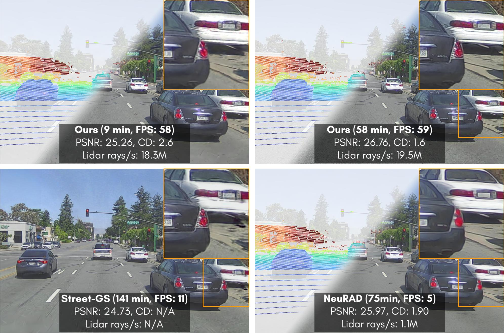
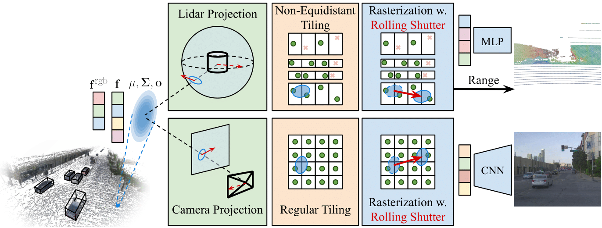
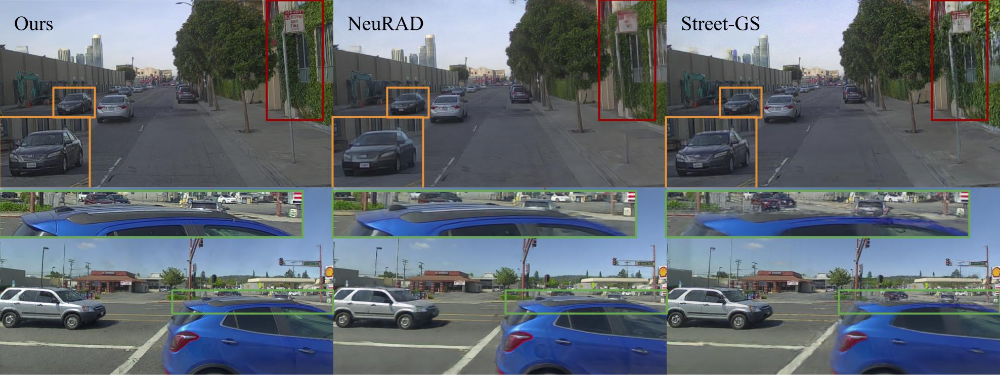

<div style="display: flex; justify-content: space-around; margin-bottom: 1em; margin-top: 0.5em; width=100%">
<figure class="figure__background">
  
  <figcaption><b>Fig 1.:</b> SplatAD is the first method capable of realistic camera and lidar rendering using 3D Gaussian Splatting. It enables real-time, high-quality rendering, and can reach competitive performance within minutes of training.</figcaption>
</figure>
</div>

---

# Abstract
Ensuring the safety of autonomous robots, such as self-driving vehicles, requires extensive testing across diverse driving scenarios. Simulation is a key ingredient for conducting such testing in a cost-effective and scalable way. Neural rendering methods have gained popularity, as they can build simulation environments from collected logs in a data-driven manner. However, existing neural radiance field (NeRF) methods for sensor-realistic rendering of camera and lidar data suffer from low rendering speeds, limiting their applicability for large-scale testing. While 3D Gaussian Splatting (3DGS) enables real-time rendering, current methods are limited to camera data and are unable to render lidar data essential for autonomous driving. To address these limitations, we propose SplatAD, the first 3DGS-based method for realistic, real-time rendering of dynamic scenes for both camera and lidar data. SplatAD accurately models key sensor-specific phenomena such as rolling shutter effects, lidar intensity, and lidar ray dropouts, using purpose-built algorithms to optimize rendering efficiency. Evaluation across three autonomous driving datasets demonstrates that SplatAD achieves state-of-the-art rendering quality with up to +2 PSNR for NVS and +3 PSNR for reconstruction while increasing rendering speed over NeRF-based methods by an order of magnitude. Code to be released upon publication.


---

# Videos

## Image and lidar rendering
SplatAD can render both images and lidar point clouds. The videos demonstrate rendered images, bird's-eye views of the rendered point cloud, and point clouds overlaid on images, with points colored based on range and intensity.
<br><br>
Note: Videos have been compressed to reduce file size. 
<div class="video-grid-1" style="display: grid; grid-template-columns: 7fr 4fr; grid-template-rows: 1fr; gap: 10px; width: 100%;">
  <video controls autoplay loop muted style="width: 100%;">
    <source src="videos/multi/rgb.mp4" type="video/mp4">
    Your browser does not support the video tag.
  </video>
  <video controls autoplay loop muted style="width: 100%;">
    <source src="videos/multi/pc_bev.mp4" type="video/mp4">
    Your browser does not support the video tag.
  </video>
</div>
<div class="video-grid-2" style="display: grid; grid-template-columns: 1fr 1fr; grid-template-rows: 1fr; gap: 10px; width: 100%;">
  <video controls autoplay loop muted style="width: 100%;">
    <source src="videos/multi/pc_overlay_range.mp4" type="video/mp4">
    Your browser does not support the video tag.
  </video>
  <video controls autoplay loop muted style="width: 100%;">
    <source src="videos/multi/pc_overlay_intensity.mp4" type="video/mp4">
    Your browser does not support the video tag.
  </video>
</div>

## Sequence browser
<div id="dataset-controls" style="margin-top: 20px; text-align: center;">
  <div class="buttons is-centered">
    <button class="button is-medium is-rounded dataset-btn active" data-dataset="PandaSet">PandaSet</button>
    <button class="button is-medium is-rounded dataset-btn" data-dataset="Argoverse2">Argoverse2</button>
    <button class="button is-medium is-rounded dataset-btn" data-dataset="nuScenes">nuScenes</button>
  </div>
</div>
<div id="scene-controls" style="margin-top: 20px; text-align: center;">
  <div class="buttons is-centered">
    <!-- Buttons will be dynamically added here -->
  </div>
</div>

<br>
Note: Videos have been compressed to reduce file size. 
<div class="video-container">
  <video id="dataset-scene-browser-video" controls autoplay loop muted style="width: 100%;">
    Your browser does not support the video tag.
  </video>
</div>

<script>
  document.addEventListener('DOMContentLoaded', function() {
    const video = document.getElementById('dataset-scene-browser-video');
    const dataset_controls = document.getElementById('dataset-controls');
    const scene_controls = document.getElementById('scene-controls');
    let activeDataset = 'PandaSet';
    const dataset_scene_map = {
      'PandaSet': ['001', '011', '016', '053', '106', '123', '158'],
      'Argoverse2': ['0b86f508', '2f2321d2', '3bffdcff', '280269f9'],
      'nuScenes': ['0039', '0061', '0104', '0193'],
    };
    let scenes = dataset_scene_map[activeDataset];
    let activeScene = scenes[0];

    function preloadImage(url) {
      return new Promise((resolve, reject) => {
        const img = new Image();
        img.onload = () => resolve(url);
        img.onerror = reject;
        img.src = url;
      });
    }
  
    // Create buttons
    scenes.forEach(scene => {
      const button = document.createElement('button');
      button.className = 'button is-medium is-rounded scene-btn';
      button.textContent = scene;
      button.dataset.scene = scene;
      scene_controls.querySelector('.buttons').appendChild(button);
    });
  
    // Set initial active button
    scene_controls.querySelector(`button[data-scene="${activeScene}"]`).classList.add('active');
  
    // Scene button click handler
    scene_controls.addEventListener('click', (e) => {
      if (e.target.matches('button')) {
        scene_controls.querySelector('.active').classList.remove('active');
        e.target.classList.add('active');
        activeScene = e.target.dataset.scene;
        updateVideo();
      }
    });

    // Dataset button click handler
    dataset_controls.addEventListener('click', (e) => {
      if (e.target.matches('button')) {
        dataset_controls.querySelector('.active').classList.remove('active');
        e.target.classList.add('active');
        activeDataset = e.target.textContent;
        activeScene = dataset_scene_map[activeDataset][0];
        updateButtons(); 
        updateVideo();
      }
    });
  
    async function updateButtons() {
      const buttonDiv = document.getElementById('scene-controls');
      const buttons = buttonDiv.querySelectorAll('button');
      buttons.forEach(button => button.remove());

      scenes = dataset_scene_map[activeDataset];
      scenes.forEach(scene => {
        const button = document.createElement('button');
        button.className = 'button is-medium is-rounded scene-btn';
        button.textContent = scene;
        button.dataset.scene = scene;
        scene_controls.querySelector('.buttons').appendChild(button);
      });

      // Set initial active button
      scene_controls.querySelector(`button[data-scene="${activeScene}"]`).classList.add('active');
    }

    async function updateVideo() {
      const videoSrc = `videos/${activeDataset}/${activeScene}.mp4`;
      try {
        video.src = videoSrc;
        video.load();
        video.play().catch(error => console.error('Error playing video:', error));
      } catch (error) {
        console.error('Error loading poster image:', error);
        video.src = videoSrc;
        video.load();
        video.play().catch(error => console.error('Error playing video:', error));
      }
    }
  
    // Initialize video
    updateVideo();
  });
</script>

## Trajectory editing
Note: Videos have been compressed to reduce file size. 
<video controls autoplay loop muted style="width: 100%;">
  <source src="videos/edits/edits.mp4" type="video/mp4">
  Your browser does not support the video tag.
</video>

---

# Method
<div style="display: flex; justify-content: space-around; margin-bottom: 1em; margin-top: 0.5em; width=100%">
<figure class="figure__background">
  
</figure>
</div>

SplatAD can render both sensor-realistic lidar and camera data from the same 3D Gaussian representation. For lidar rendering, we:
<ol>
<li>Project the 3D Gaussians to spherical coordinates.</li>
<li>Intersect Gaussians with non-equdistant tiles, matching to the lidar beam distribution.</li>
<li>Rasterize depth and features for a non-linear grid of points, with rolling shutter compensation.</li>
<li>Decode features to lidar intensity and lidar ray drop probability.</li>
</ol> 
For efficiency, we implement these operations using custom CUDA kernels. 

For the camera rendering, we modify the standard 3DGS pipeline:
<ul>
<li>Rasterize RGB and features, which are decoded to view-dependent colors using a small CNN.</li>
<li>Apply rolling shutter compensation.</li>
</ul>

---

# Comparisons

<div style="display: flex; justify-content: space-around; margin-bottom: 1em; margin-top: 0.5em; width=100%">
  
</div>

<div style="display: flex; justify-content: space-around; margin-bottom: 1em; margin-top: 0.5em; width=100%">
  
    
</div>

<div style="display: flex; justify-content: space-around; margin-bottom: 1em; margin-top: 0.5em; width=100%">
  
</div>

<div style="display: flex; justify-content: space-around; margin-bottom: 1em; margin-top: 0.5em;">
<figure class="figure__background">
  
  <figcaption><b>Fig 6.:</b> SplatAD learns both sharp and accurate geometries, in constrast to NeuRADs oversmoothed results, and Steet Gaussians cutting through objects due to erroneous line-of-sight. </figcaption>
</figure>
</div>

---

# BibTeX
```bibtex
@article{hess2024splatad,
  title        = {SplatAD: Real-Time Lidar and Camera Rendering with 3D Gaussian Splatting for Autonomous Driving},
  author       = {Hess, Georg and Lindstr{\"o}m, Carl and Fatemi, Maryam and Petersson, Christoffer and Svensson, Lennart},
  journal      = {arXiv preprint arXiv:2411:XXXXX},
  year         = {2024}
}
```
