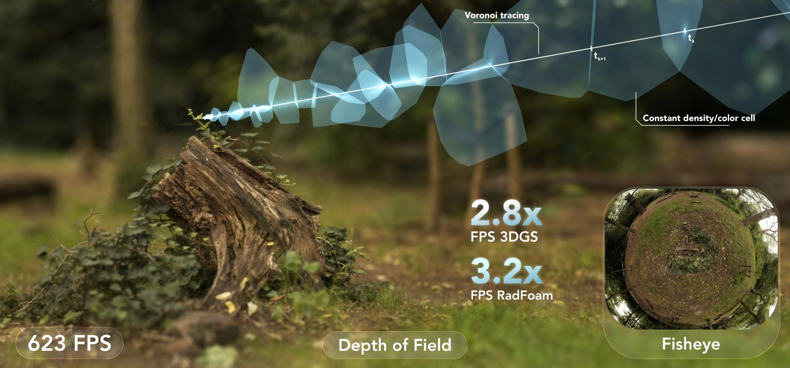
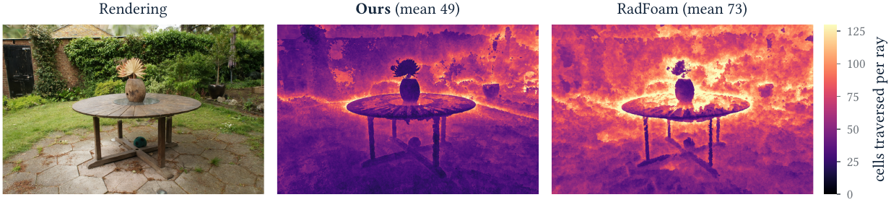
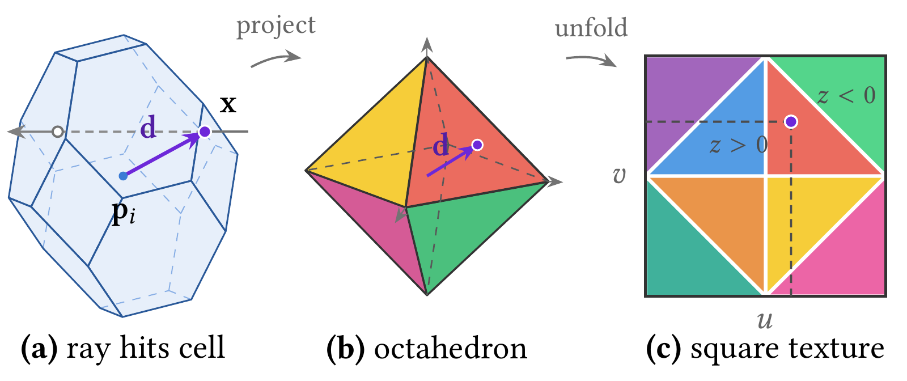
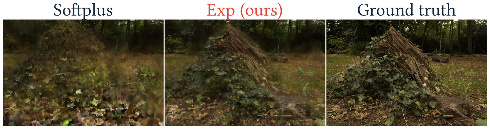
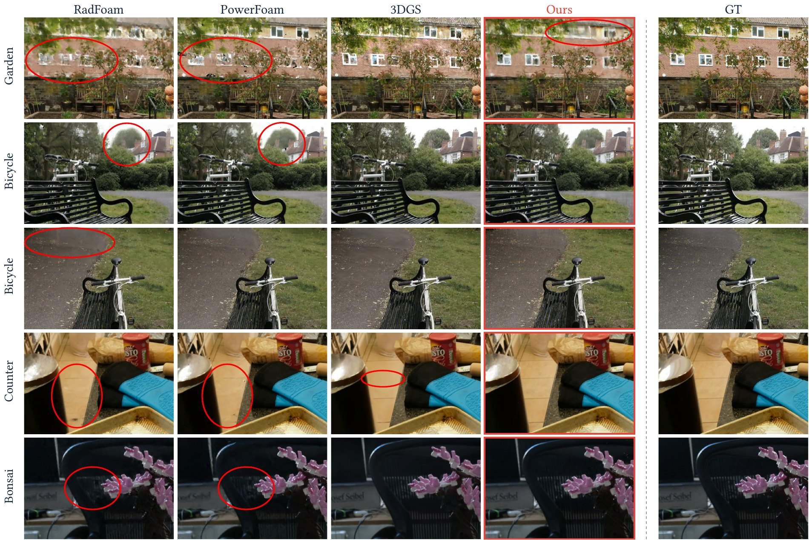

<div style="text-align: center; margin-bottom: 1em;">
<h1>TL;DR</h1>
<p style="font-weight: 500; width: min(90%, 760px); margin: 0 auto;">
A differentiable ray tracer for novel view synthesis that renders <em>faster</em> than most rasterized splatting &mdash; 623 FPS on Mip-NeRF 360, <strong>3.2&times;</strong> the fastest prior ray tracer and <strong>2.8&times;</strong> 3D Gaussian Splatting &mdash; with fisheye lenses, rolling shutter, and motion blur falling out of ray generation for free.
</p>
</div>

<div style="display: flex; justify-content: space-around; margin-bottom: 1em; margin-top: 0.5em; width: 100%">
<figure class="figure__background">
  
  <figcaption><b>Fig 1.:</b> The highlighted path is an actual camera ray traversing the scene's Voronoi diagram cell by cell; light blue regions are the projected footprints of the cells it visits. The main image has a shallow depth of field and the inset is a fisheye view of the same scene &mdash; both from the same trained representation, changing only the rays.</figcaption>
</figure>
</div>

---

# Rays or speed, but not both?

3D Gaussian Splatting<d-cite key="kerbl20233d"></d-cite> made novel view synthesis real-time by borrowing the rasterization playbook: project every primitive, sort, blend. The field has been paying for it ever since. Fisheye and distorted cameras need modified projections<d-cite key="wu20253dgut"></d-cite>, rolling shutter needs time-aware projection, depth of field needs extra passes &mdash; and recent methods bolt ray tracing back on top of the rasterizer to recover general image formation<d-cite key="govindarajan2026power"></d-cite>.

The general assumption is that rays give flexibility and rasterization gives speed. **We think that trade-off is not inherent**.

Our starting point is Radiant Foam's insight<d-cite key="govindarajan2025radiant"></d-cite>: represent the scene as a Voronoi diagram, so a ray steps from cell to neighbouring cell through local adjacency instead of repeatedly intersecting a BVH<d-cite key="moenne20243d"></d-cite>. Rendering cost then depends only on *how many cells each ray visits*, not on how many primitives the scene contains &mdash; and profiling that renderer, three quarters of kernel time goes to neighbour search alone. So the method reduces to two goals: **visit fewer cells, and make each visit cheaper.**

---

# Fewer cells: concentrate the opacity

A ray composites every cell it enters until transmittance runs out. Spread opacity across a wide shell of barely-opaque cells and each ray pays for dozens of composites. What we want instead is a thin, opaque surface: rays cross empty cells until they reach one opaque cell whose texture explains the colour, and terminate there.



Training pushes the representation toward the right panel. A distortion loss<d-cite key="barron2022mip"></d-cite> concentrates each ray's compositing weight at a single depth, and a scale-invariant exponential density makes small and large cells optimize at the same rate. Opacity comes out strongly bimodal &mdash; cells are either near-transparent or near-opaque, with **24 % above &alpha; = 0.9** against Radiant Foam's 4 %. Radiant Foam instead strands 44 % of its cells in the semi-transparent middle, and every one of those has to be composited. Ours traverse a mean of **46.1 cells instead of 66.9**, a 31 % reduction, using roughly half as many cells per scene.

<div style="display: flex; justify-content: space-around; margin-bottom: 1em; margin-top: 0.5em; width: 100%">
<figure class="figure__background">
  
  <figcaption><b>Fig 2.:</b> Cells traversed per ray, in image space, on the same held-out Garden view and colour scale. Cost concentrates on foliage and silhouettes and is low on smooth surfaces. The mean drops from 73 to 49 cells per ray through a broad reduction across the image, not a few isolated easy pixels.</figcaption>
</figure>
</div>

---

# Cheaper visits: octahedral textures instead of spherical harmonics

The other cost at every ray&ndash;cell interaction is appearance. Degree-3 spherical harmonics mean loading 48 coefficients per cell, and SH can only vary with *direction* &mdash; spatial detail within a single view needs ever more, ever smaller cells, until each cell is seen by one ray from one direction, overfits, and leaves the geometry under-constrained.

We give each cell a tiny 8&times;8 RGB texture instead, indexed by the direction from the cell's site to where the ray pierces the cell boundary. Voronoi cells are convex, so that direction identifies the boundary point uniquely, and an octahedral mapping<d-cite key="cigolle2014survey"></d-cite> unfolds the sphere of directions onto the square with low distortion and no polar singularities.

<div style="display: flex; justify-content: space-around; margin-bottom: 1em; margin-top: 0.5em; width: 100%">
<figure class="figure__background" style="max-width: 620px;">
  
  <figcaption><b>Fig 3.:</b> <b>(a)</b> A camera ray crosses a cell; the direction from the site to the hit point selects the appearance. <b>(b)</b> That direction is normalized onto the unit octahedron. <b>(c)</b> The octahedron unfolds into the square texture, upper hemisphere in the central diamond, lower hemisphere in the corners.</figcaption>
</figure>
</div>

The demo below sweeps that direction around a tilted great circle. As it crosses the equator, watch the sampled point slide out of the central diamond and into the unfolded corners &mdash; continuously, with no seams and no poles.



A second per-cell texture, indexed by view direction, adds a small residual for highlights and reflections, regularized to stay subordinate to the surface texture. Together the two bilinear fetches load a fixed 24 values in place of 48 SH coefficients, and a single cell can now show spatial detail within one view. This texture block is the largest single quality contribution in our ablations: PSNR 28.23 &rarr; **28.98 dB**, LPIPS 0.280 &rarr; **0.235**, while *also* raising throughput from 475 to 623 FPS.

---

# Training without heuristics

No pruning, no densification, no opacity resets, no resolution schedules. Following EDGS<d-cite key="kotovenko2026edgs"></d-cite> we triangulate a dense point cloud from RoMa v2<d-cite key="edstedt2025roma"></d-cite> correspondences, subsample it to a fixed budget of **2M sites**, and optimize positions, densities, and both texture maps for **20k steps**. The cell set never changes; cells and adjacency are rebuilt on the GPU as sites move<d-cite key="taveira2026paragram"></d-cite>. Training takes 33&ndash;50 minutes per scene on a single RTX 5090.

What makes the heuristics unnecessary is a scale-invariant density. Under softplus, the density a cell needs to reach a given opacity scales *inversely* with the ray's segment length through it, while the gradient on that density scales *linearly* with it &mdash; so a small cell needs a higher density and receives a proportionally weaker gradient to get there. Parameterizing density as an exponential, &sigma; = exp(&rho;), and optimizing &rho; makes the segment length cancel exactly, so two cells of equal opacity get identically scaled gradients whatever their size.

Without it, cells that should be empty instead settle at a low but non-zero density and objects keep a persistent haze around them, along with floaters. From a dense initialization this can run away in free space near the camera, and once those cells turn opaque, early ray termination starves everything behind them of gradient and the optimization cannot recover.

<div style="display: flex; justify-content: space-around; margin-bottom: 1em; margin-top: 0.5em; width: 100%">
<figure class="figure__background" style="max-width: 720px;">
  
  <figcaption><b>Fig 4.:</b> The same held-out <i>stump</i> view after only 1000 steps. Softplus is still hazy and washed out; the scale-invariant exponential has already recovered sharp geometry and colour.</figcaption>
</figure>
</div>

The distortion weight is then the single speed&ndash;quality knob: stronger concentration thins the surfaces and terminates rays sooner.

---

# Results

Mip-NeRF 360 on an RTX 5090. The timed region deliberately includes per-view camera setup and the initial nearest-cell query, making it stricter than the upstream benchmarks of Radiant Foam and 3DGRT.



VoroTracing reaches **28.98 dB** PSNR / 0.848 SSIM / 0.235 LPIPS at **623 FPS** &mdash; 3.2&times; Radiant Foam, 2.8&times; 3DGS, and 2.1&times; the fastest prior baseline. Where we do not win: outdoors 3DGS is still 0.71 dB ahead and Triangle Splatting<d-cite key="held2026triangle"></d-cite> gives the best LPIPS. Indoors it reverses, and at 31.42 dB we have the best indoor PSNR of any real-time method in the comparison.

The renderer and the representation are not separable contributions. Our inference stack &mdash; Morton cell ordering, warp-coherent 4&times;8 ray tiling, and skipping texture evaluation for cells that cannot affect the colour &mdash; takes the base renderer from 230 to 623 FPS on our representation, a 2.7&times; gain at no measurable cost in quality. The same stack applied to Radiant Foam's *own* representation gets only 194 to 384 FPS. The gap is the point: as traversal and scheduling overheads fall away, appearance evaluation takes a larger share of the frame, and that is exactly what the octahedral textures and the concentrated opacity attack.

<div style="display: flex; justify-content: space-around; margin-bottom: 1em; margin-top: 0.5em; width: 100%">
<figure class="figure__background">
  
  <figcaption><b>Fig 5.:</b> Held-out crops of regions observed by few training images, where our fixed 2M-cell budget is most visible: we preserve more structure than Radiant Foam but stay less detailed than 3DGS. Red circles mark representative artifacts.</figcaption>
</figure>
</div>

---

# What rays buy you

Image formation lives entirely in ray generation, so non-pinhole cameras and lens effects need no modified projection maths and no extra passes. Everything below renders the *same trained representation*, changing only the rays sent to the renderer.

<div class="voro-clips">
  <figure>
    <video class="voro-clip" preload="none" loop muted playsinline disablepictureinpicture><source src="videos/fisheye.mp4" type="video/mp4"></video>
    <figcaption>(a) Pinhole morphing to fisheye</figcaption>
  </figure>
  <figure>
    <video class="voro-clip" preload="none" loop muted playsinline disablepictureinpicture><source src="videos/rolling-shutter.mp4" type="video/mp4"></video>
    <figcaption>(b) Rolling shutter, sweeping readout</figcaption>
  </figure>
  <figure>
    <video class="voro-clip" preload="none" loop muted playsinline disablepictureinpicture><source src="videos/motion-blur.mp4" type="video/mp4"></video>
    <figcaption>(c) Motion blur, sweeping exposure</figcaption>
  </figure>
  <figure>
    <video class="voro-clip" preload="none" loop muted playsinline disablepictureinpicture><source src="videos/mobile.mp4" type="video/mp4"></video>
    <figcaption>(d) Interactive on an iPhone 16</figcaption>
  </figure>
</div>
<figcaption style="text-align: center;"><b>Fig 6.:</b> The mobile clip runs the <i>same uncompressed 2M-site Garden model</i> as the desktop evaluation, ported to Metal compute kernels, at roughly 40 FPS. Videos have been compressed to reduce file size.</figcaption>

The renderer also runs in the browser over WebGPU, on the same fp16 inference path, with a live pinhole&harr;fisheye toggle. It renders **entirely on your own GPU** &mdash; a pre-trained scene file is downloaded once and then traced locally, with nothing computed on a server. The frame rate you get is therefore your machine's, not the RTX 5090 figures quoted above.

<p style="text-align: center; margin: 1.4em 0 0.6em;">
  <a class="btn btn--primary" href="viewer/" style="font-size: 0.7rem;">Open the live WebGPU viewer &rarr;</a>
</p>

<p style="text-align: center; font-style: italic; color: #6B7280; font-size: 0.7rem;">
Needs Chrome or Edge 113+, or Safari 26+, and a reasonably capable GPU for interactive rates. Scenes are uncompressed 2M-site models and load in full before rendering starts, so each is a ~1.7&nbsp;GB download.
</p>

---

# Limitations

The fixed cell budget is the main constraint. Where few training views observe a region, dense matching supplies too few reliable sites, and since the cell set never changes the model cannot allocate capacity there later; an adaptive strategy could. None of this argues that adaptive cell insertion is unimportant &mdash; better densification should improve future systems. The claim is only that it should not be *necessary* to get high-quality reconstructions out of a well-posed representation.

Separately, fisheye and rolling shutter keep one ray per pixel, but depth of field and motion blur submit several, so the 623 FPS pinhole number does not carry over to them.

A natural next step is explicit surface extraction: a Voronoi diagram with surface-concentrated opacity and surface-indexed textures is a promising starting point for a textured mesh that drops into standard rendering pipelines.

---

# BibTeX

```bibtex
@article{taveira2026vorotracing,
  title={Differentiable Voronoi Ray Tracing Beyond Rasterization Speeds},
  author={Bernardo Taveira and Carl Lindstr{\"o}m and Joakim Johnander and Fredrik Kahl},
  journal={arXiv preprint arXiv:2608.17682},
  year={2026}
}
```

<style>
.voro-clips {
  display: grid;
  grid-template-columns: repeat(2, 1fr);
  gap: 0.6rem 0.8rem;
  margin: 1.2em 0 0.5rem;
}
@media (max-width: 600px) {
  .voro-clips { grid-template-columns: 1fr; }
}
.voro-clips figure { margin: 0; }
.voro-clips figcaption { text-align: center; }
.voro-clip {
  display: block;
  width: 100%;
  aspect-ratio: 16 / 9;
  object-fit: cover;
  border-radius: 6px;
  background: #F7F6F3;
}
</style>

<script>
// The clips are short loops, so they play themselves while on screen rather
// than waiting for a hover. Loading is deferred until the grid is near the
// viewport so the four files aren't fetched on page load.
(function () {
  var clips = document.querySelectorAll('.voro-clip');
  if (!clips.length) return;
  var reduce = window.matchMedia &&
    window.matchMedia('(prefers-reduced-motion: reduce)').matches;
  if (reduce || !('IntersectionObserver' in window)) {
    clips.forEach(function (v) { v.setAttribute('controls', ''); v.preload = 'metadata'; });
    return;
  }
  var io = new IntersectionObserver(function (entries) {
    entries.forEach(function (e) {
      var v = e.target;
      if (e.isIntersecting) {
        if (v.preload === 'none') v.preload = 'auto';
        var p = v.play();
        if (p && p.catch) p.catch(function () {});
      } else {
        v.pause();
      }
    });
  }, { threshold: 0.25 });
  clips.forEach(function (v) { io.observe(v); });
})();
</script>
